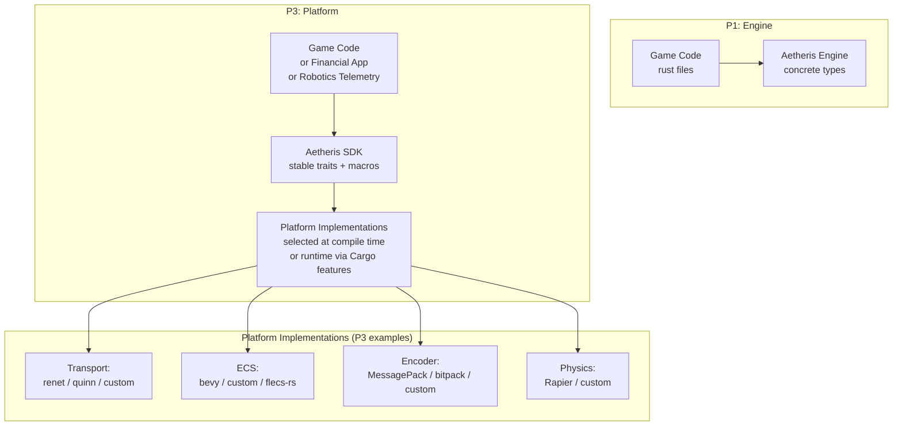
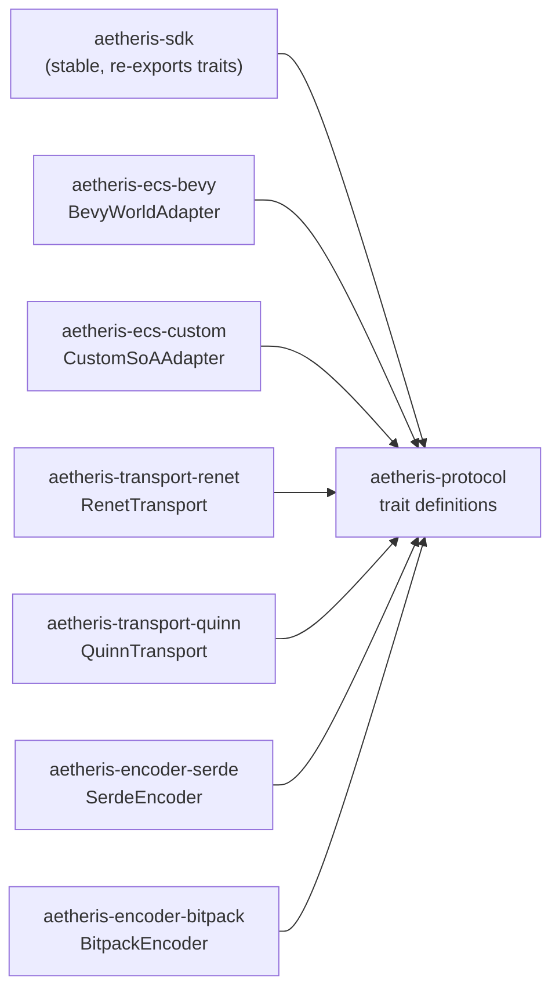
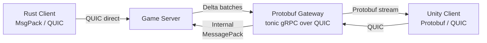

# Aetheris Engine — Platform Architecture & Design Document

## Table of Contents

1. [Executive Summary](#executive-summary)
2. [What Is a Platform vs. an Engine](#2-what-is-a-platform-vs-an-engine)
3. [Stable API Surface — The Trait Triad](#3-stable-api-surface--the-trait-triad)
4. [The Aetheris Standard Library](#4-the-aetheris-standard-library)
5. [Third-Party Extension Model](#5-third-party-extension-model)
6. [Binary Protocol Interoperability](#6-binary-protocol-interoperability)
7. [SDK Design — Game Developer Ergonomics](#7-sdk-design--game-developer-ergonomics)
8. [Deployment Model — Modular Core](#8-deployment-model--modular-core)
9. [Versioning & Stability Guarantees](#9-versioning--stability-guarantees)
10. [Observability as a Platform Primitive](#10-observability-as-a-platform-primitive)
11. [Performance Contracts](#11-performance-contracts)
12. [Open Questions](#12-open-questions)
13. [Appendix A — Glossary](#appendix-a--glossary)
14. [Appendix B — Decision Log](#appendix-b--decision-log)

---

## Executive Summary

Aetheris begins as a game engine but is architecturally designed to become a **general-purpose, high-performance distributed state synchronisation platform**. The distinction:

- **Engine:** Aetheris ships a complete, opinionated stack (Bevy ECS + renet + MessagePack) for building a specific class of real-time multiplayer game.
- **Platform:** Aetheris exposes a **stable trait API** that allows third-party developers to swap every subsystem, add custom components, and build non-game applications (financial tickers, collaborative simulations, robotics telemetry) on the same infrastructure.

**Platform readiness is a P3 milestone.** The MVP (P1) ships the engine. P3 ships the SDK: documentation, examples, extension registry, and guaranteed API stability.

The Platform's enabling principle is the **Modular Core**:

> **Every subsystem in Aetheris is a swappable dependency, not a hard-coded singleton. The core coordinates contracts; implementations are pluggable.**

---

## 2. What Is a Platform vs. an Engine



The transition from Engine to Platform requires:

1. The **Trait Triad** (`GameTransport`, `WorldState`, `Encoder`) to be stabilised and semver-guaranteed.
2. A **Cargo feature flag** system where each implementation crate is independently optional.
3. A **Platform SDK crate** (`aetheris-sdk`) that re-exports only the stable API surface.
4. An **extension trait** system for adding custom component types without forking the engine.

---

## 3. Stable API Surface — The Trait Triad

The Trait Triad is the contractual boundary between platform code (stable) and implementation code (replaceable).

### 3.1 GameTransport Trait (Stable)

```rust
/// The stable transport abstraction.
/// Implementations: RenetTransport (P1), QuinnTransport (P3), CustomTransport (third-party)
pub trait GameTransport: Send + Sync + 'static {
    /// Poll the transport for incoming events. Called once per tick in Stage 1 (poll).
    /// Must complete in O(connected_clients) time.
    fn poll_events(&mut self) -> Vec<NetworkEvent>;

    /// Send unreliable payload to one client. Fire-and-forget.
    fn send_unreliable(&self, client_id: ClientId, data: &[u8]) -> Result<(), TransportError>;

    /// Send reliable payload to one client. Guaranteed delivery.
    fn send_reliable(&self, client_id: ClientId, data: &[u8]) -> Result<(), TransportError>;

    /// Broadcast unreliable payload to all connected clients.
    fn broadcast_unreliable(&self, data: &[u8]) -> Result<(), TransportError>;

    // Note: broadcast_reliable is Planned (P3). Not in the current trait.
    // When added, it will include a default implementation for backward compatibility.

    /// Current number of connected clients.
    fn connected_client_count(&self) -> usize;
}
```

**Stability promise (P3):** `GameTransport` is `#[cfg_attr(feature = "stable", stable)]` from `aetheris-sdk 1.0.0`. Adding new methods requires a new trait version with a default implementation for backward compatibility.

### 3.2 WorldState Trait (Stable)

```rust
/// The stable ECS abstraction.
/// Implementations: BevyWorldAdapter (P1), CustomSoAAdapter (P3), FlecsBridge (third-party)
pub trait WorldState: Send + 'static {
    /// Resolve a NetworkId → LocalId mapping.
    fn get_local_id(&self, net: NetworkId) -> Option<LocalId>;

    /// Resolve a LocalId → NetworkId mapping.
    fn get_network_id(&self, local: LocalId) -> Option<NetworkId>;

    /// Extract all changed components since last tick.
    /// This is the hot path — must be O(changed_count), not O(total_entities).
    /// Requires `&mut self` to advance the internal change-detection cursor.
    fn extract_deltas(&mut self) -> Vec<ReplicationEvent>;

    /// Apply incoming component updates from the network.
    fn apply_updates(&mut self, updates: Vec<ComponentUpdate>);

    /// Runs a single simulation frame (game logic, physics, AI).
    fn simulate(&mut self);

    /// Spawn a new networked entity. The ECS allocates and returns the NetworkId.
    fn spawn_networked(&mut self) -> NetworkId;

    /// Despawn a networked entity.
    fn despawn_networked(&mut self, net: NetworkId) -> Result<(), WorldError>;
}
```

### 3.3 Encoder Trait (Stable)

```rust
/// The stable encoding abstraction.
/// Implementations: SerdeEncoder (P1 MessagePack), BitpackEncoder (P3), ProtoEncoder (third-party)
pub trait Encoder: Send + Sync + 'static {
    /// Serialize a ReplicationEvent into a caller-provided buffer.
    ///
    /// Returns the number of bytes written, or `EncodeError::BufferOverflow`
    /// if the buffer is too small. Never allocates — write into `buffer`.
    fn encode(&self, event: &ReplicationEvent, buffer: &mut [u8]) -> Result<usize, EncodeError>;

    /// Deserialize bytes from the wire into a ComponentUpdate.
    fn decode(&self, bytes: &[u8]) -> Result<ComponentUpdate, EncodeError>;

    /// Encode a NetworkEvent (Ping/Pong, heartbeats) to bytes.
    fn encode_event(&self, event: &NetworkEvent, buffer: &mut [u8]) -> Result<usize, EncodeError>;

    /// Decode a NetworkEvent from bytes.
    fn decode_event(&self, data: &[u8]) -> Result<NetworkEvent, EncodeError>;

    /// Maximum encoded size for a single event. Used for buffer pre-sizing.
    fn max_encoded_size(&self) -> usize;
}
```

### 3.4 Dependency Graph of the SDK



End-user `Cargo.toml`:

```toml
[dependencies]
aetheris-sdk = "1.0"   # Stable traits + types

# Pick exactly one implementation for each subsystem:
aetheris-transport-renet   = { version = "1.0", optional = true }
aetheris-ecs-bevy          = { version = "1.0", optional = true }
aetheris-encoder-serde     = { version = "1.0", optional = true }

[features]
default = ["aetheris-transport-renet", "aetheris-ecs-bevy", "aetheris-encoder-serde"]
high-perf = ["aetheris-transport-quinn", "aetheris-ecs-custom", "aetheris-encoder-bitpack"]
```

---

## 4. The Aetheris Standard Library

> **Implementation status (P3 — Planned):** The `aetheris-stdlib` crate does **not yet exist**
> in the workspace. The physics bridge, spatial partitioning, and standard components described
> below are design targets for Phase 3.

The Aetheris Standard Library (`aetheris-stdlib`) ships a curated set of **production-ready component implementations** that game developers can use without writing engine internals.

### 4.1 Physics Bridge — Rapier

```rust
// aetheris-stdlib/src/physics/rapier.rs
// Bridges the Rapier physics engine into the Aetheris component model.
// Rapier simulation runs as a Bevy system; physics state is extracted
// as NetworkedComponent::RigidBody and NetworkedComponent::Collider.

pub struct RapierPhysicsPlugin;
impl Plugin for RapierPhysicsPlugin {
    fn build(&self, app: &mut App) {
        app.add_plugins(RapierPhysicsPlugin);
        app.add_systems(
            AetherisTickSet::Simulate,
            (rapier_step_simulation, extract_physics_state_to_network).chain(),
        );
    }
}
```

**Physics replication strategy:**

- Position, velocity, and rotation are replicated each tick for all physics entities.
- Collision events are replicated as reliable `GameEvent::Collision` messages.
- Client-side prediction applies Rapier physics locally using the same parameters.

### 4.2 Spatial Partitioning — k-d Tree / Octree

```rust
// aetheris-stdlib/src/spatial.rs
// Spatial partitioning for AOI (Area of Interest) queries.
// Determines which entities are "visible" to each player and should
// be replicated in their delta batch.

pub trait SpatialIndex: Send + Sync {
    fn insert(&mut self, net: NetworkId, position: Vec3);
    fn remove(&mut self, net: NetworkId);
    fn update(&mut self, net: NetworkId, position: Vec3);

    /// Returns all NetworkIds within `radius` of `center`.
    fn query_radius(&self, center: Vec3, radius: f32) -> SmallVec<[NetworkId; 64]>;
}

pub struct KdTreeIndex(kiddo::KdTree<f32, 3>);
pub struct OctreeIndex(/* ... */);
```

AOI filtering is applied in Stage 4 (extract) before building delta batches. Each client receives only the entities within their configured visibility radius (default: 100 world units). This is the primary scale mechanism: even with 10,000 entities in the world, a client near entity X only receives deltas for the ~50 entities around them.

> **Canonical Sources:** See [SPATIAL_PARTITIONING_DESIGN.md](SPATIAL_PARTITIONING_DESIGN.md) for the engine's spatial hash grid implementation (replacing k-d tree/octree with hash grid in Phase 3), and [INTEREST_MANAGEMENT_DESIGN.md](INTEREST_MANAGEMENT_DESIGN.md) for the unified interest pipeline that composes spatial, room, tenant, and custom filters.

### 4.3 Standard Component Types

```rust
// aetheris-stdlib/src/components.rs
// These are opinionated default components; game developers can define
// their own using the component registration DSL (see §5).

#[derive(Component, Replicate, Debug, Clone)]
pub struct Position(pub Vec3);

#[derive(Component, Replicate, Debug, Clone)]
pub struct Velocity(pub Vec3);

#[derive(Component, Replicate, Debug, Clone)]
pub struct Rotation(pub Quat);

#[derive(Component, Replicate, Debug, Clone)]
pub struct Health {
    pub current: f32,
    pub max: f32,
}

#[derive(Component, Replicate, Debug, Clone)]
pub struct Inventory {
    pub items: SmallVec<[ItemSlot; 16]>,  // inline for ≤16 items
}
```

---

## 5. Third-Party Extension Model

Third-party developers can add custom component types to Aetheris without forking the engine. The extension model uses:

1. **Procedural macros** (`#[derive(Replicate)]`) to generate component registration boilerplate.
2. **An extension registry** (`ComponentRegistry`) that maps `ComponentKind(u16)` discriminants to encode/decode functions.
3. **Cargo crate distribution:** Extensions are published as standard Rust crates on crates.io.

### 5.1 `#[derive(Replicate)]` Macro

```rust
use aetheris_sdk::Replicate;

// A custom component for a fantasy RPG:
#[derive(Component, Replicate, Debug, Clone)]
#[replicate(kind = 0x0100, reliability = Unreliable)]
pub struct ManaPool {
    pub current: f32,
    pub max: f32,
    pub regen_rate: f32,
}
```

The derive macro generates:

- `impl NetworkedComponent for ManaPool { const KIND: ComponentKind = ComponentKind(0x0100); ... }`
- `fn encode(c: &ManaPool, writer: &mut impl EncoderWriter) { ... }` (using the configured encoder)
- `fn decode(reader: &mut impl DecoderReader) -> ManaPool { ... }`
- Registration code that inserts into the `ComponentRegistry` at startup.

### 5.2 `ComponentKind` Namespace Management

To prevent collisions between the stdlib (0x0000–0x00FF), official extensions (0x0100–0x0FFF), and community extensions (0x1000–0xFFFF):

| Range | Owner |
|---|---|
| `0x0000–0x00FF` | Aetheris Engine (stdlib components) |
| `0x0100–0x0FFF` | Official Aetheris Labs extensions |
| `0x1000–0xFFFF` | Community / third-party extensions |

Community extensions SHOULD register their claimed ranges in the [Aetheris Extension Registry](https://registry.aetheris.dev) (P4 infrastructure) to prevent collisions.

### 5.3 Extension Crate Template

```
my_extension/
  Cargo.toml
  src/
    lib.rs         # #[derive(Replicate)] components
    systems.rs     # Bevy systems that operate on these components
    plugin.rs      # AetherisPlugin impl: registers components + systems
  examples/
    demo.rs        # Minimal working demo with aetheris-sdk
```

---

## 6. Binary Protocol Interoperability

### 6.1 Non-Rust Clients

Aetheris targets Rust clients (native + WASM), but the P3 platform must support non-Rust clients for:

- Mobile games (Unity/C#, Godot/GDScript)
- Server-to-server integrations
- Analytics aggregators

### 6.2 Protocol Buffers as the Interop Layer

For non-Rust clients, Aetheris exposes a **protobuf-based gateway** that translates between the binary MessagePack wire format (internal) and protobuf (external):



The Protobuf Gateway is an optional sidecar component (a separate binary, same process option planned for P4). It translates:

- `ComponentUpdate` (MessagePack) ↔ `ComponentUpdateProto` (protobuf)
- `ReplicationEvent` (binary) ↔ `ReplicationEventProto` (protobuf)

The protobuf schema is auto-generated from the `ComponentRegistry` at server startup.

### 6.3 SDK Language Bindings (P4)

P4 targets automatically-generated client SDKs for:

- **C#:** Via `protoc-gen-csharp` + a thin QUIC wrapper (dotnet-quic or custom UDP stack)
- **TypeScript:** Existing WASM client serves as the reference; proto bindings for non-WASM paths
- **Python:** `grpcio` + `protobuf` for analytics integrations

---

## 7. SDK Design — Game Developer Ergonomics

The primary audience for the Aetheris SDK is a senior Rust developer building a real-time multiplayer game. Secondary audience: TypeScript developers using the WASM client.

### 7.1 Minimal Working Server (Boilerplate Goal)

> **Status (P3 — Planned):** `AetherisServer::builder()` does **not yet exist**. The current
> server startup uses explicit construction in `main.rs`. The example below is the P3 SDK target.

The P3 SDK aims for a minimal working server in ≤ 30 lines:

> [!NOTE]
> This API represents the P3 SDK target. The current server startup is configured via `main.rs` with explicit construction.

```rust
use aetheris_sdk::prelude::*;
use aetheris_transport_renet::RenetTransport;
use aetheris_ecs_bevy::BevyWorldAdapter;
use aetheris_encoder_serde::SerdeEncoder;

#[tokio::main]
async fn main() -> anyhow::Result<()> {
    let server = AetherisServer::builder()
        .transport(RenetTransport::new("0.0.0.0:4433").await?)
        .world(BevyWorldAdapter::new())
        .encoder(SerdeEncoder::default())
        .tick_rate(60)
        .max_clients(2500)
        .build()?;

    // Attach game systems to the simulate stage:
    server.world_mut().add_systems(
        AetherisTickSet::Simulate,
        (movement_system, combat_system).chain(),
    );

    server.run().await
}
```

### 7.2 Client SDK (TypeScript / WASM)

```typescript
// Minimal WASM client setup:
import { AetherisClient } from '@aetheris/client-wasm';

const client = await AetherisClient.connect({
    serverUrl: 'https://play.example.com:4433',
    connectToken: await fetchConnectToken(),
    onStateUpdate: (entities: EntityState[]) => renderer.updateScene(entities),
    onDisconnect: () => console.warn('Disconnected'),
});

client.sendInput({ move: { x: 1, y: 0 } });
```

---

## 8. Deployment Model — Modular Core

### 8.1 Feature Flags

Every subsystem is independently selectable via Cargo features:

```toml
# aetheris-sdk/Cargo.toml (simplified)
[features]
# Transport implementations
transport-renet       = ["dep:aetheris-transport-renet"]
transport-quinn       = ["dep:aetheris-transport-quinn"]
transport-webtransport = ["dep:aetheris-transport-webtransport"]

# ECS implementations
ecs-bevy             = ["dep:aetheris-ecs-bevy"]
ecs-custom           = ["dep:aetheris-ecs-custom"]

# Encoder implementations
encoder-serde        = ["dep:aetheris-encoder-serde"]
encoder-bitpack      = ["dep:aetheris-encoder-bitpack"]

# Standard library extensions
stdlib-physics       = ["dep:aetheris-stdlib", "aetheris-stdlib/physics"]
stdlib-spatial       = ["dep:aetheris-stdlib", "aetheris-stdlib/spatial"]

# P1 default: renet + bevy-ecs + msgpack
default = ["transport-renet", "ecs-bevy", "encoder-serde"]
```

### 8.2 Compile-Time Dispatch vs. Runtime Dispatch

The Trait Triad uses **compile-time dispatch** (`impl Trait` / generics) inside the engine for zero-overhead abstraction. **Runtime dispatch** (`dyn Trait`) is reserved for extension points where the concrete type is only known at runtime (e.g., the `ComponentRegistry` decode table).

```rust
// Compile-time (monomorphised, zero overhead):
pub struct AetherisServer<T, W, E>
where
    T: GameTransport,
    W: WorldState,
    E: Encoder
{
    transport: T,
    world: W,
    encoder: E,
}

// Runtime (dynamic component registry, one allocation per decode):
pub struct ComponentRegistry {
    decoders: HashMap<ComponentKind, Box<dyn ComponentDecoder>>,
}
```

### 8.3 Binary Size Budget

| Target | Max binary size (release + LTO) | Notes |
|---|---|---|
| Server (native, all features) | ≤ 50 MB | Stripped, release build |
| Client native | ≤ 30 MB | Stripped |
| Client WASM (loaded by browser) | ≤ 1.2 MB gzip | wasm-opt + wasm-pack |
| Extension crates (typical) | ≤ 500 KB | No std needed; `#![no_std]` encouraged |

---

## 9. Versioning & Stability Guarantees

### 9.1 Semver Policy

| Crate | Stability | Policy |
|---|---|---|
| `aetheris-sdk` | **Stable** (P3+) | Semver: breaking changes require major version bump |
| `aetheris-protocol` | **Stable** (P3+) | Traits only; no impl details |
| `aetheris-transport-*` | **Unstable** | Minor versions may break consumers |
| `aetheris-ecs-*` | **Unstable** | Internal ECS crate, not public API |
| `aetheris-encoder-*` | **Unstable** | Internal encoder, not public API |

### 9.2 Minimum Supported Rust Version (MSRV)

- P3 targets **Rust stable** for `aetheris-sdk`. The requirement for `nightly` (for WASM `thread_local`) is confined to `aetheris-client-wasm` only.
- MSRV is pinned in `rust-toolchain.toml` for the server and SDK crates.
- MSRV bumps require announcing in `CHANGELOG.md` with 2-release advance notice.

---

## 10. Observability as a Platform Primitive

The Aetheris platform ships observability tooling as a **first-class primitive**, not an afterthought. Every SDK integration automatically emits:

### 10.1 Automatic Metrics from `aetheris-sdk`

Any server using `AetherisServer::builder()` automatically gets:

| Metric | Type | Description |
|---|---|---|
| `aetheris_tick_duration` | Histogram | Full tick wall time (all 5 stages) |
| `aetheris_connected_clients` | Gauge | Current client count |
| `aetheris_entities_total` | Gauge | Total entities in ECS world |
| `aetheris_entities_replicated_per_tick` | Histogram | Dirty entities per tick |
| `aetheris_bytes_sent_per_tick` | Histogram | Wire bytes per tick (all clients) |
| `aetheris_transport_rtt` | Histogram | Round-trip time per client |

### 10.2 Tracing Spans

All 5 tick stages are wrapped in `tracing::Span` with consistent `target = "aetheris::tick"` for Jaeger integration:

```rust
let _poll_span  = info_span!("tick.poll",  tick = tick_number).entered();
let _apply_span = info_span!("tick.apply", tick = tick_number).entered();
// ... etc
```

Extensions hook into the tracing ecosystem via standard `tracing::instrument` on their systems.

---

## 11. Performance Contracts

| Metric | Target | Notes |
|---|---|---|
| Trait dispatch overhead (Encoder, Transport) | 0 ns compile-time dispatch | Zero-cost abstraction |
| Component registration at startup | O(N), where N = registered types | One HashMap insert per type |
| AOI spatial query per client (k-d tree) | ≤ 10 μs per query | With 10,000 entities in index |
| Extension system overhead per entity | 0 ns (compile-time) | Dynamic dispatch only in registry table |
| Minimising binary size (WASM) | ≤ 1.2 MB gzip | Enabled by `#![no_std]` stdlib and dead-code elimination |

### 11.1 Extension System Telemetry

Third-party extensions are expected to emit metrics in the `aetheris_ext_{extension_name}_*` namespace. The SDK provides a helper:

```rust
use aetheris_sdk::metrics::ExtensionMetrics;

pub struct MyExtensionMetrics {
    m: ExtensionMetrics,
}
impl MyExtensionMetrics {
    pub fn new() -> Self {
        Self { m: ExtensionMetrics::new("my_combat_extension") }
    }
    pub fn record_hit(&self) {
        self.m.counter("hits_total").increment(1);
    }
}
// Emitted as: aetheris_ext_my_combat_extension_hits_total
```

---

## 12. Open Questions

| Question | Context | Impact |
|---|---|---|
| **Plugin Hot-Reload** | Should the platform support dynamic loading of `.so`/`.dll` plugins at runtime? | Ease of development vs security and complexity. |
| **SDK Language Target** | Which language should be prioritized for the first non-Rust SDK after TS? | Market reach and developer interest. |
| **WASM Performance** | Can we move the entire Trait Triad implementation to WASM for server-side modularity? | Sandbox isolation vs native performance. |

---

## 13. Appendix A — Glossary

### Mini-Glossary (Quick Reference)

- **Platform vs Engine**: The Engine is a ready-to-use game stack; the Platform is a collection of swappable traits.
- **Trait Triad**: The three fundamental traits (Transport, ECS, Encoder) that define the Aetheris API.
- **aetheris-sdk**: The stable, public-facing crate used for building applications on top of the engine.
- **ComponentKind**: A 16-bit identifier used to route data to the correct encoder/decoder.
- **Modular Core**: The architectural principle that every subsystem must be replaceable.

[Full Glossary Document](../GLOSSARY.md)

---

## Appendix B — Decision Log

| # | Decision | Rationale | Revisit If... | Date |
|---|---|---|---|---|
| D1 | Platform P3 Milestone | Allows the engine to stabilize before freezing public API contracts. | Rapid adoption requires stable traits earlier. | 2026-04-15 |
| D2 | Generic Monomorphization | Zero-overhead abstraction for the high-frequency tick pipeline stages. | Compile times become the primary developer blocker. | 2026-04-15 |
| D3 | 16-bit ComponentKind | Balanced range (65k types) vs wire efficiency (2 bytes). | Ecosystem exceeds 65,536 unique component types. | 2026-04-15 |
| D4 | Sidecar Gateway for Interop | Keeps the core binary format (MsgPack) lean while supporting C#/JS. | Native Protobuf support becomes more performant. | 2026-04-15 |
| D5 | Stable SDK MSRV | Ensures a wide range of developers can use the SDK without unstable Rust. | Critical language features (e.g. SIMD) require Nightly. | 2026-04-15 |

## Appendix A — Glossary

Refer to the master [Glossary](../GLOSSARY.md) for project-wide technical terms.
