---Version: 0.1.0-draft
Status: Phase 1 — MVP
Phase: P1 | P2 | P3+
Last Updated: 2026-04-15
Authors: Team (Antigravity)
Spec References: [ENGINE_DESIGN, CLIENT_DESIGN, ECS_DESIGN, PERSISTENCE_DESIGN, SECURITY_DESIGN, NETWORKING_DESIGN, PRIORITY_CHANNELS_DESIGN]
Tier: 4
License: CC-BY-4.0
---

## Executive Summary

**Aetheris: Void Rush** is the flagship title designed to validate the Aetheris Engine as a production-grade, authoritative-server platform for real-time multiplayer games running in the browser. A game engine without a game is an untested hypothesis — Void Rush is the experiment that proves (or disproves) every architectural decision documented across this project.

**Why a space MMO?**

| Design Constraint | Why Space Solves It |
|---|---|
| **Rendering cost** | Empty void = minimal scene geometry, freeing GPU budget for entity count |
| **Physics validation** | Newtonian inertial flight is the hardest test for Client-Side Prediction |
| **Zero-Trust stress** | Ore-to-credit economy requires tamper-proof transactional integrity |
| **Scalability ceiling** | 1,000 concurrent players per sector pushes every subsystem to its limit |
| **Browser viability** | Top-down 3D with simple shaders fits the WebGPU/wgpu budget |

Void Rush is **not** a separate product — it is the **MVP validation layer** of the Aetheris Engine itself. Every gameplay system maps directly to an engine subsystem, and every design decision is justified by what it exercises in the platform.

## Table of Contents

1. [Executive Summary](#1-executive-summary)
2. [Product Vision & Scope](#2-product-vision--scope)
3. [Core Gameplay Loop](#3-core-gameplay-loop)
4. [Ship Classes & Combat Design](#4-ship-classes--combat-design)
5. [World Architecture & Sector Topology](#5-world-architecture--sector-topology)
6. [ECS Component Model](#6-ecs-component-model)
7. [Priority Channels — The Bandwidth Problem](#7-priority-channels--the-bandwidth-problem)
8. [Ballistic Replication — The Projectile Problem](#8-ballistic-replication--the-projectile-problem)
9. [Spatial Partitioning — The Collision Problem](#9-spatial-partitioning--the-collision-problem)
10. [Inertial Interpolation — The Visual Problem](#10-inertial-interpolation--the-visual-problem)
11. [Transactional Economy — The Zero-Trust Test](#11-transactional-economy--the-zero-trust-test)
12. [Client Rendering Pipeline](#12-client-rendering-pipeline)
13. [Control Plane Integration](#13-control-plane-integration)
14. [Anti-Cheat & Security Model](#14-anti-cheat--security-model)
15. [Phased Delivery Roadmap](#15-phased-delivery-roadmap)
16. [Performance Contracts](#16-performance-contracts)
17. [Open Questions](#17-open-questions)
18. [Appendix A — Glossary](#appendix-a--glossary)
19. [Appendix B — Decision Log](#appendix-b--decision-log)

---

## 1. Executive Summary

**Aetheris: Void Rush** is the flagship title designed to validate the Aetheris Engine as a production-grade, authoritative-server platform for real-time multiplayer games running in the browser. A game engine without a game is an untested hypothesis — Void Rush is the experiment that proves (or disproves) every architectural decision documented across this project.

**Why a space MMO?**

| Design Constraint | Why Space Solves It |
|---|---|
| **Rendering cost** | Empty void = minimal scene geometry, freeing GPU budget for entity count |
| **Physics validation** | Newtonian inertial flight is the hardest test for Client-Side Prediction |
| **Zero-Trust stress** | Ore-to-credit economy requires tamper-proof transactional integrity |
| **Scalability ceiling** | 1,000 concurrent players per sector pushes every subsystem to its limit |
| **Browser viability** | Top-down 3D with simple shaders fits the WebGPU/wgpu budget |

Void Rush is **not** a separate product — it is the **MVP validation layer** of the Aetheris Engine itself. Every gameplay system maps directly to an engine subsystem, and every design decision is justified by what it exercises in the platform.

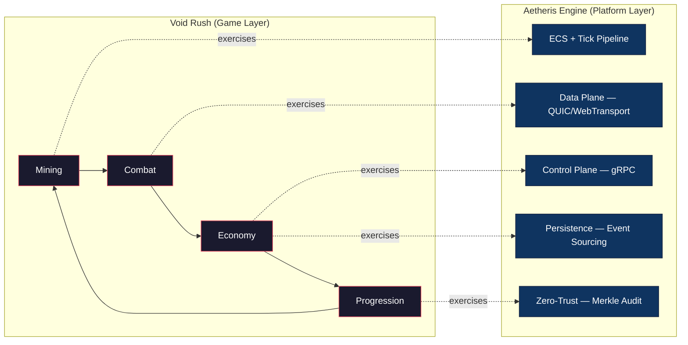
```mermaid
graph LR
    subgraph "Void Rush (Game Layer)"
        A[Mining] --> B[Combat]
        B --> C[Economy]
        C --> D[Progression]
        D --> A
    end

    subgraph "Aetheris Engine (Platform Layer)"
        E[ECS + Tick Pipeline]
        F[Data Plane — QUIC/WebTransport]
        G[Control Plane — gRPC]
        H[Persistence — Event Sourcing]
        I[Zero-Trust — Merkle Audit]
    end

    A -. "exercises" .-> E
    B -. "exercises" .-> F
    C -. "exercises" .-> G
    C -. "exercises" .-> H
    D -. "exercises" .-> I

    style A fill:#1a1a2e,stroke:#e94560,color:#fff
    style B fill:#1a1a2e,stroke:#e94560,color:#fff
    style C fill:#1a1a2e,stroke:#e94560,color:#fff
    style D fill:#1a1a2e,stroke:#e94560,color:#fff
    style E fill:#0f3460,stroke:#16213e,color:#fff
    style F fill:#0f3460,stroke:#16213e,color:#fff
    style G fill:#0f3460,stroke:#16213e,color:#fff
    style H fill:#0f3460,stroke:#16213e,color:#fff
    style I fill:#0f3460,stroke:#16213e,color:#fff
```

---

## 2. Product Vision & Scope

### 2.1 Phase 1 — MVP ("Prove the Engine")

A **top-down 3D space shooter** (physics on a 2D plane, visuals in 3D). Players mine asteroids, trade ore for credits at Space Stations (Safe Zones), and purchase upgrades. Combat is limited to lasers and basic missiles. Sectors are instanced with a hard cap of **1,000 simultaneous players per sector**.

**In-scope for MVP:**

- 3 ship classes (Interceptor, Dreadnought, Hauler)
- 2 weapon types (Laser, Missile)
- 1 resource type (Raw Ore)
- Safe Zone docking and trading
- PvP in open space, PvE asteroid drones
- Leaderboard (kills, ore mined, credits earned)

**Explicitly out-of-scope for MVP:**

- Player crafting
- Guild/Corporation systems
- Territory control
- Capital ships
- Cross-sector seamless travel

### 2.2 Phase 2 — Depth ("Stress the Economy")

- Multiple ore types with rarity tiers
- Player-to-player marketplace (auction house)
- Ship module crafting from refined ores
- NPC faction reputation system
- Stress testing at 2,500+ concurrent players per sector

### 2.3 Phase 3+ — Scale ("Break the Boundaries")

- Guild/Corporation system with station ownership
- Territory control and sovereignty mechanics
- Capital ships requiring multi-crew operation
- Seamless universe: dynamic server partitioning (Federation layer)
- Cross-sector travel without loading screens

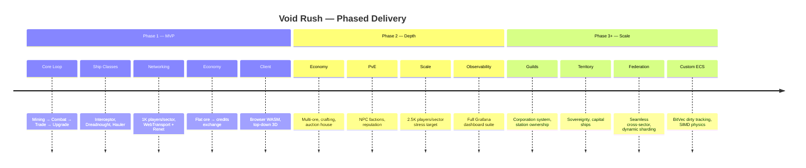
```mermaid
timeline
    title Void Rush — Phased Delivery
    section Phase 1 — MVP
        Core Loop      : Mining → Combat → Trade → Upgrade
        Ship Classes   : Interceptor, Dreadnought, Hauler
        Networking     : 1K players/sector, WebTransport + Renet
        Economy        : Flat ore → credits exchange
        Client         : Browser WASM, top-down 3D
    section Phase 2 — Depth
        Economy        : Multi-ore, crafting, auction house
        PvE            : NPC factions, reputation
        Scale          : 2.5K players/sector stress target
        Observability  : Full Grafana dashboard suite
    section Phase 3+ — Scale
        Guilds         : Corporation system, station ownership
        Territory      : Sovereignty, capital ships
        Federation     : Seamless cross-sector, dynamic sharding
        Custom ECS     : BitVec dirty tracking, SIMD physics
```

---

## 3. Core Gameplay Loop

The Void Rush core loop is a **risk-reward cycle** built around cargo vulnerability. Every step maps to a distinct engine subsystem under test.

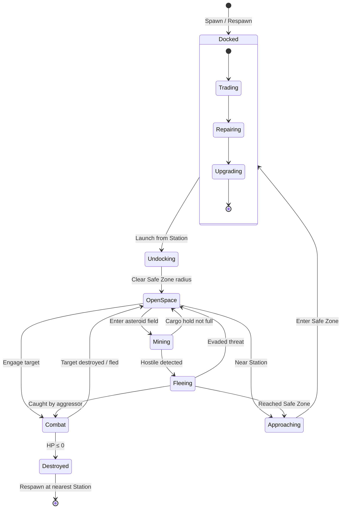
```mermaid
stateDiagram-v2
    [*] --> Docked: Spawn / Respawn

    Docked --> Undocking: Launch from Station
    Undocking --> OpenSpace: Clear Safe Zone radius

    OpenSpace --> Mining: Enter asteroid field
    Mining --> OpenSpace: Cargo hold not full
    Mining --> Fleeing: Hostile detected

    OpenSpace --> Combat: Engage target
    Combat --> Destroyed: HP ≤ 0
    Combat --> OpenSpace: Target destroyed / fled

    OpenSpace --> Approaching: Near Station
    Approaching --> Docked: Enter Safe Zone

    Fleeing --> OpenSpace: Evaded threat
    Fleeing --> Combat: Caught by aggressor
    Fleeing --> Approaching: Reached Safe Zone

    Destroyed --> [*]: Respawn at nearest Station

    state Docked {
        [*] --> Trading
        Trading --> Repairing
        Repairing --> Upgrading
        Upgrading --> [*]
    }
```

### 3.1 Collect (PvE)

The player undocks from a Station and navigates to an **Asteroid Field** — a cluster of destructible entities. Using a **mining laser** (channeled weapon), the player breaks down asteroids into `RawOre` units that automatically transfer into their `CargoHold`.

**Engine subsystems exercised:**

- `WorldState::simulate()` — asteroid HP depletion, ore spawning
- `Encoder::encode()` — delta replication of asteroid state changes
- `GameTransport::send_unreliable()` — volatile position updates

### 3.2 Risk (PvPvE)

Deep space is **Free-for-All** (PvP open). Players carrying full cargo are penalized with increased mass → decreased acceleration → they become visible high-value targets. NPC **Alien Drones** patrol rare ore deposits, adding PvE threat.

**The Cargo-Mass Mechanic:**

$$
a_{effective} = \frac{F_{thrust}}{m_{hull} + m_{ore} \times n_{ore}}
$$

Where:

- $F_{thrust}$ = engine thrust force (ship-class dependent)
- $m_{hull}$ = base hull mass
- $m_{ore}$ = mass per ore unit (constant: 0.5 mass units)
- $n_{ore}$ = current ore count in `CargoHold`

A fully loaded Hauler (500 ore) has mass $m_{hull} + 250$, reducing effective acceleration by up to 60%.

**Engine subsystems exercised:**

- Client-Side Prediction with variable mass (reconciliation complexity)
- `SuspicionScore` anomaly detection (impossible velocity checks)
- Spatial Partitioning for efficient PvP proximity detection

### 3.3 Trade (Safe Zone)

Returning to a Station enters a **Safe Zone** — a server-enforced radius where all damage is nullified. Inside, the player accesses a docking UI to:

1. **Sell** raw ore for credits (server-authoritative transaction)
2. **Repair** hull damage (credit cost proportional to damage)
3. **Browse** the upgrade shop

**Engine subsystems exercised:**

- Control Plane `EconomyService` (gRPC transactional RPC)
- Persistence Sink — event-sourced ledger for all credit mutations
- Zero-Trust hash verification on wallet state

### 3.4 Progress

Credits purchase upgrades that change the player's `Loadout` component:

| Upgrade Slot | Examples | Effect |
|---|---|---|
| **Chassis** | Interceptor Mk I → Mk III | Base stats (HP, mass, accel) |
| **Weapon** | Pulse Laser, Beam Laser, Seeker Missile | DPS, range, energy cost |
| **Engine** | Thruster Mk I → Mk III | Max velocity, acceleration |
| **Shield** | Light Shield, Heavy Shield | Damage absorption, recharge rate |

**Engine subsystems exercised:**

- `InventoryService` (Control Plane gRPC)
- `Loadout` component replication (Data Plane delta sync)
- Idempotency keys for purchase transactions

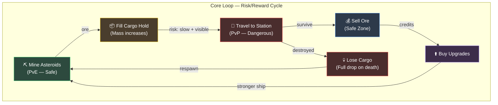
```mermaid
graph TD
    subgraph "Core Loop — Risk/Reward Cycle"
        MINE["⛏️ Mine Asteroids<br/>(PvE — Safe)"] -->|ore| CARGO["📦 Fill Cargo Hold<br/>(Mass increases)"]
        CARGO -->|"risk: slow + visible"| TRAVEL["🚀 Travel to Station<br/>(PvP — Dangerous)"]
        TRAVEL -->|"survive"| SELL["💰 Sell Ore<br/>(Safe Zone)"]
        TRAVEL -->|"destroyed"| LOSE["💀 Lose Cargo<br/>(Full drop on death)"]
        SELL -->|"credits"| UPGRADE["⬆️ Buy Upgrades"]
        UPGRADE -->|"stronger ship"| MINE
        LOSE -->|"respawn"| MINE
    end

    style MINE fill:#2d4a3e,stroke:#4ade80,color:#fff
    style CARGO fill:#4a3d2d,stroke:#facc15,color:#fff
    style TRAVEL fill:#4a2d2d,stroke:#ef4444,color:#fff
    style SELL fill:#2d3a4a,stroke:#60a5fa,color:#fff
    style LOSE fill:#4a2d2d,stroke:#ef4444,color:#fff
    style UPGRADE fill:#3d2d4a,stroke:#a78bfa,color:#fff
```

---

## 4. Ship Classes & Combat Design

### 4.1 The Spatial Trinity (Rock-Paper-Scissors)

Ship classes form a **counter-triangle** based on inertia and mass mechanics. No single class dominates; effectiveness depends on engagement context.

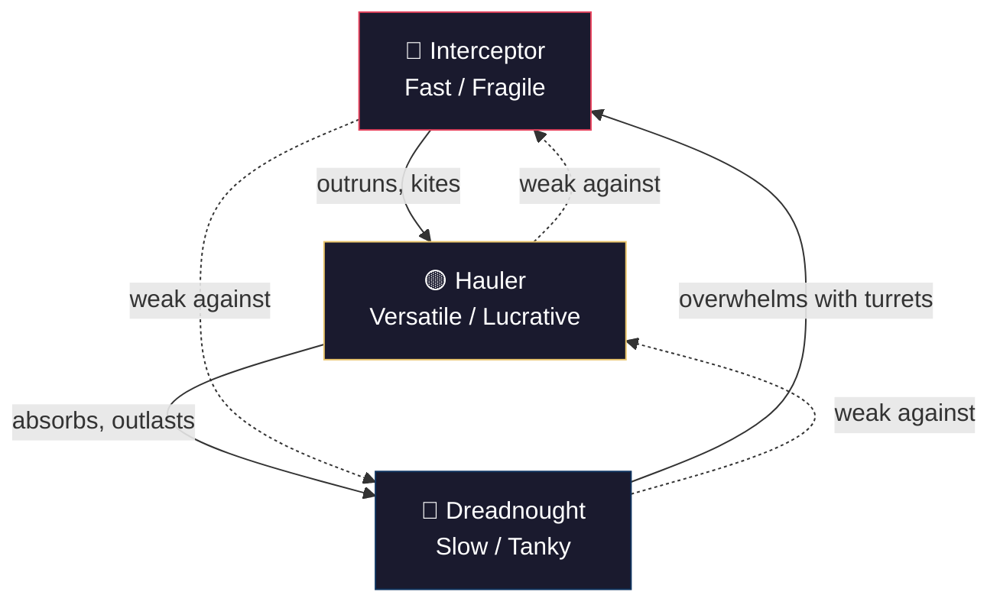
```mermaid
graph TD
    INT["🔺 Interceptor<br/>Fast / Fragile"]
    DRD["🔷 Dreadnought<br/>Slow / Tanky"]
    HAU["🟡 Hauler<br/>Versatile / Lucrative"]

    INT -->|"outruns, kites"| HAU
    HAU -->|"absorbs, outlasts"| DRD
    DRD -->|"overwhelms with turrets"| INT

    INT -. "weak against" .-> DRD
    DRD -. "weak against" .-> HAU
    HAU -. "weak against" .-> INT

    style INT fill:#1a1a2e,stroke:#e94560,color:#fff
    style DRD fill:#1a1a2e,stroke:#0f3460,color:#fff
    style HAU fill:#1a1a2e,stroke:#e9c46a,color:#fff
```

### 4.2 Ship Statistics (MVP Baseline)

| Stat | Interceptor | Dreadnought | Hauler |
|---|---|---|---|
| **Base Mass** | 50 | 300 | 150 |
| **Max HP** | 200 | 1500 | 600 |
| **Shield HP** | 100 | 500 | 200 |
| **Shield Regen/s** | 5 | 15 | 8 |
| **Thrust Force** | 500 | 200 | 350 |
| **Max Velocity** | 120 m/s | 40 m/s | 70 m/s |
| **Turn Rate** | 270°/s | 60°/s | 150°/s |
| **Cargo Capacity** | 50 | 100 | 500 |
| **Weapon Slots** | 2 | 6 (4 auto-turrets) | 2 |
| **Energy Pool** | 100 | 300 | 150 |
| **Energy Regen/s** | 10 | 20 | 12 |

### 4.3 Combat Mechanics

#### Weapons (MVP)

| Weapon | Type | Damage | Range | Fire Rate | Energy Cost | Delivery |
|---|---|---|---|---|---|---|
| **Pulse Laser** | Hitscan | 15 | 300m | 5/s | 3 | Instant (raycast) |
| **Beam Laser** | Channel | 8/tick | 200m | Continuous | 2/tick | Sustained DPS |
| **Mining Laser** | Channel | 20/tick (rocks only) | 150m | Continuous | 1/tick | PvE only |
| **Seeker Missile** | Projectile | 80 | 500m | 1/s | 25 | Tracking entity |

#### Damage Pipeline

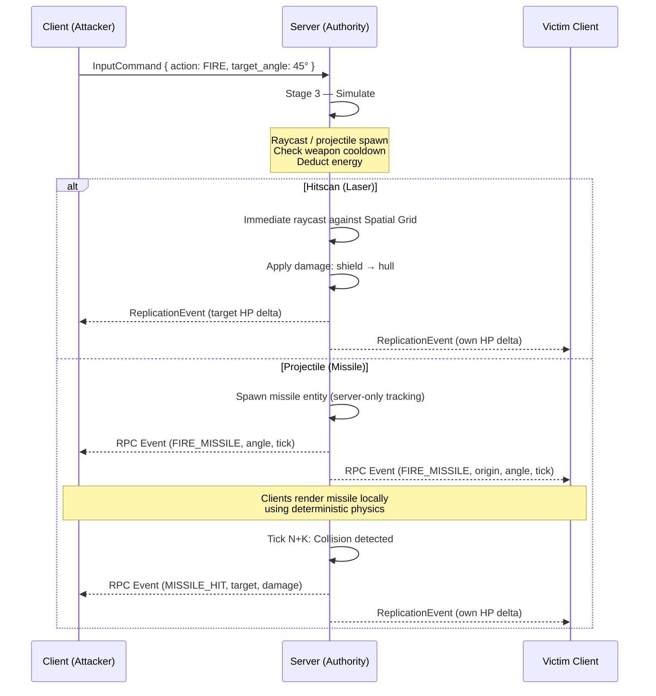
```mermaid
sequenceDiagram
    participant C as Client (Attacker)
    participant S as Server (Authority)
    participant V as Victim Client

    C->>S: InputCommand { action: FIRE, target_angle: 45° }
    S->>S: Stage 3 — Simulate
    Note over S: Raycast / projectile spawn<br/>Check weapon cooldown<br/>Deduct energy

    alt Hitscan (Laser)
        S->>S: Immediate raycast against Spatial Grid
        S->>S: Apply damage: shield → hull
        S-->>C: ReplicationEvent (target HP delta)
        S-->>V: ReplicationEvent (own HP delta)
    else Projectile (Missile)
        S->>S: Spawn missile entity (server-only tracking)
        S-->>C: RPC Event (FIRE_MISSILE, angle, tick)
        S-->>V: RPC Event (FIRE_MISSILE, origin, angle, tick)
        Note over C,V: Clients render missile locally<br/>using deterministic physics
        S->>S: Tick N+K: Collision detected
        S-->>C: RPC Event (MISSILE_HIT, target, damage)
        S-->>V: ReplicationEvent (own HP delta)
    end
```

#### Shield & Hull Damage Model

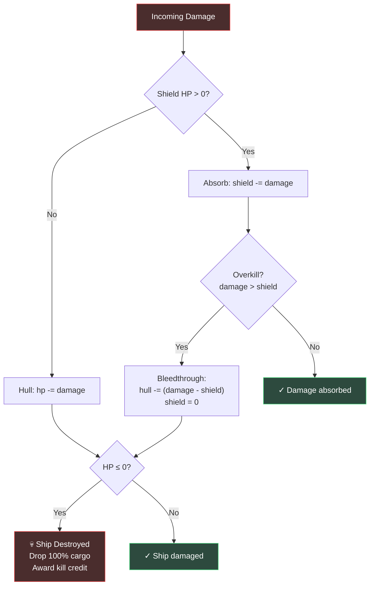
```mermaid
graph TD
    DMG["Incoming Damage"] --> SHIELD{"Shield HP > 0?"}
    SHIELD -->|Yes| ABS["Absorb: shield -= damage"]
    SHIELD -->|No| HULL["Hull: hp -= damage"]
    ABS --> OVER{"Overkill?<br/>damage > shield"}
    OVER -->|Yes| BLEED["Bleedthrough:<br/>hull -= (damage - shield)<br/>shield = 0"]
    OVER -->|No| DONE["✓ Damage absorbed"]
    HULL --> DEAD{"HP ≤ 0?"}
    BLEED --> DEAD
    DEAD -->|Yes| DESTROY["💀 Ship Destroyed<br/>Drop 100% cargo<br/>Award kill credit"]
    DEAD -->|No| DONE2["✓ Ship damaged"]

    style DMG fill:#4a2d2d,stroke:#ef4444,color:#fff
    style DESTROY fill:#4a2d2d,stroke:#ef4444,color:#fff
    style DONE fill:#2d4a3e,stroke:#4ade80,color:#fff
    style DONE2 fill:#2d4a3e,stroke:#4ade80,color:#fff
```

---

## 5. World Architecture & Sector Topology

### 5.1 Sector Model (MVP)

The game universe is divided into **Sectors** — discrete instanced zones, each managed by a dedicated server process. Players travel between sectors via **Jump Gates** (loading transition in P1, seamless in P3+).

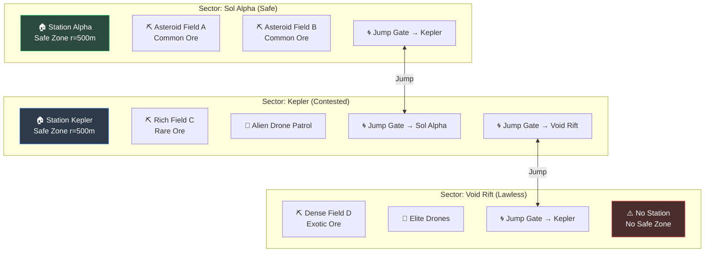
```mermaid
graph TD
    subgraph "Sector: Sol Alpha (Safe)"
        SA_STATION["🏠 Station Alpha<br/>Safe Zone r=500m"]
        SA_FIELD1["⛏️ Asteroid Field A<br/>Common Ore"]
        SA_FIELD2["⛏️ Asteroid Field B<br/>Common Ore"]
        SA_GATE1["🌀 Jump Gate → Kepler"]
    end

    subgraph "Sector: Kepler (Contested)"
        K_STATION["🏠 Station Kepler<br/>Safe Zone r=500m"]
        K_FIELD1["⛏️ Rich Field C<br/>Rare Ore"]
        K_DRONES["👾 Alien Drone Patrol"]
        K_GATE1["🌀 Jump Gate → Sol Alpha"]
        K_GATE2["🌀 Jump Gate → Void Rift"]
    end

    subgraph "Sector: Void Rift (Lawless)"
        VR_FIELD1["⛏️ Dense Field D<br/>Exotic Ore"]
        VR_DRONES["👾 Elite Drones"]
        VR_GATE1["🌀 Jump Gate → Kepler"]
        VR_NO_STATION["⚠️ No Station<br/>No Safe Zone"]
    end

    SA_GATE1 <-->|"Jump"| K_GATE1
    K_GATE2 <-->|"Jump"| VR_GATE1

    style SA_STATION fill:#2d4a3e,stroke:#4ade80,color:#fff
    style K_STATION fill:#2d3a4a,stroke:#60a5fa,color:#fff
    style VR_NO_STATION fill:#4a2d2d,stroke:#ef4444,color:#fff
```

### 5.2 Sector Danger Tiers

| Tier | Example | Station? | PvP Rules | Ore Rarity | NPC Threat |
|---|---|---|---|---|---|
| **Safe** | Sol Alpha | Yes (large Safe Zone) | PvP outside Safe Zone only | Common | None |
| **Contested** | Kepler | Yes (small Safe Zone) | Full PvP everywhere | Common + Rare | Patrol drones |
| **Lawless** | Void Rift | **No** | Full PvP, no Safe Zone | Rare + Exotic | Elite drones |

### 5.3 Sector Server Architecture

Each sector is a standalone Aetheris Server instance running the 5-stage tick pipeline:

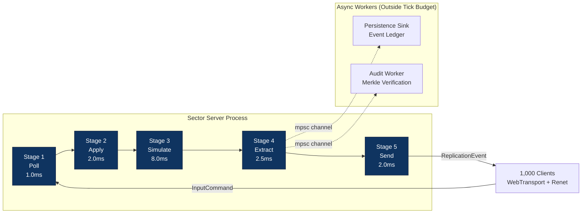
```mermaid
graph LR
    subgraph "Sector Server Process"
        direction LR
        POLL["Stage 1<br/>Poll<br/>1.0ms"] --> APPLY["Stage 2<br/>Apply<br/>2.0ms"]
        APPLY --> SIM["Stage 3<br/>Simulate<br/>8.0ms"]
        SIM --> EXTRACT["Stage 4<br/>Extract<br/>2.5ms"]
        EXTRACT --> SEND["Stage 5<br/>Send<br/>2.0ms"]
    end

    CLIENTS["1,000 Clients<br/>WebTransport + Renet"] -->|"InputCommand"| POLL
    SEND -->|"ReplicationEvent"| CLIENTS

    subgraph "Async Workers (Outside Tick Budget)"
        PERSIST["Persistence Sink<br/>Event Ledger"]
        AUDIT["Audit Worker<br/>Merkle Verification"]
    end

    EXTRACT -.->|"mpsc channel"| PERSIST
    EXTRACT -.->|"mpsc channel"| AUDIT

    style POLL fill:#0f3460,stroke:#16213e,color:#fff
    style APPLY fill:#0f3460,stroke:#16213e,color:#fff
    style SIM fill:#0f3460,stroke:#16213e,color:#fff
    style EXTRACT fill:#0f3460,stroke:#16213e,color:#fff
    style SEND fill:#0f3460,stroke:#16213e,color:#fff
```

### 5.4 Entity Budget per Sector (MVP)

| Entity Type | Max Count | Replicated? | Update Frequency |
|---|---|---|---|
| Player Ships | 1,000 | Yes (Transform, Velocity, ShipStats) | 60 Hz |
| Asteroids | 5,000 | Yes (Transform, HP) | On change only |
| Projectiles (Missiles) | 2,000 | **No** (event-driven) | N/A |
| Lasers (Hitscan) | N/A | **No** (RPC events) | N/A |
| NPC Drones | 200 | Yes (Transform, Velocity, HP) | 60 Hz |
| Loot Drops | 500 | Yes (Transform, contents) | On spawn/despawn |
| Stations | 3–5 | Yes (static, one-time) | On connect |
| **Total Replicated** | **~6,700** | — | — |

---

## 6. ECS Component Model

### 6.1 Component Classification

All components fall into two categories based on replication policy:

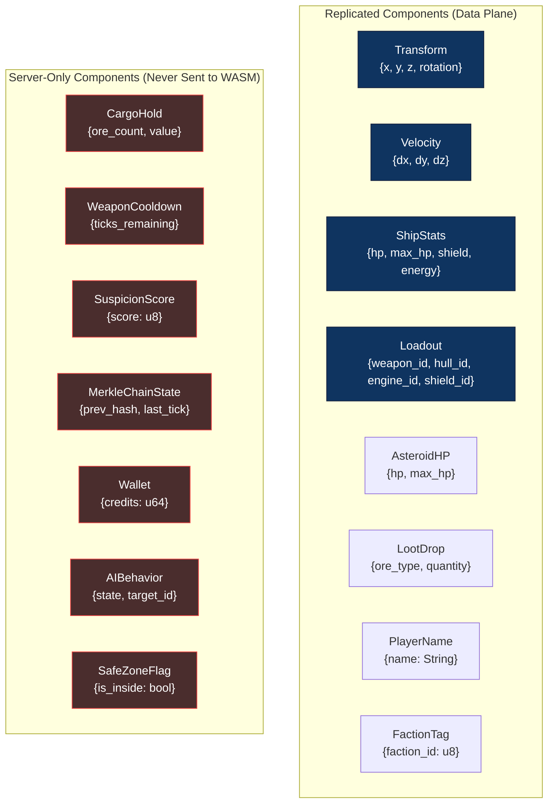
```mermaid
graph TD
    subgraph "Replicated Components (Data Plane)"
        T["Transform<br/>{x, y, z, rotation}"]
        V["Velocity<br/>{dx, dy, dz}"]
        SS["ShipStats<br/>{hp, max_hp, shield, energy}"]
        LO["Loadout<br/>{weapon_id, hull_id, engine_id, shield_id}"]
        AH["AsteroidHP<br/>{hp, max_hp}"]
        LOOT["LootDrop<br/>{ore_type, quantity}"]
        NAME["PlayerName<br/>{name: String}"]
        TEAM["FactionTag<br/>{faction_id: u8}"]
    end

    subgraph "Server-Only Components (Never Sent to WASM)"
        CH["CargoHold<br/>{ore_count, value}"]
        WC["WeaponCooldown<br/>{ticks_remaining}"]
        SUS["SuspicionScore<br/>{score: u8}"]
        MCS["MerkleChainState<br/>{prev_hash, last_tick}"]
        WALLET["Wallet<br/>{credits: u64}"]
        AI["AIBehavior<br/>{state, target_id}"]
        SZ["SafeZoneFlag<br/>{is_inside: bool}"]
    end

    style T fill:#0f3460,stroke:#16213e,color:#fff
    style V fill:#0f3460,stroke:#16213e,color:#fff
    style SS fill:#0f3460,stroke:#16213e,color:#fff
    style LO fill:#0f3460,stroke:#16213e,color:#fff
    style CH fill:#4a2d2d,stroke:#ef4444,color:#fff
    style WC fill:#4a2d2d,stroke:#ef4444,color:#fff
    style SUS fill:#4a2d2d,stroke:#ef4444,color:#fff
    style MCS fill:#4a2d2d,stroke:#ef4444,color:#fff
    style WALLET fill:#4a2d2d,stroke:#ef4444,color:#fff
    style AI fill:#4a2d2d,stroke:#ef4444,color:#fff
    style SZ fill:#4a2d2d,stroke:#ef4444,color:#fff
```

### 6.2 Component Definitions (Rust)

```rust
// ──────────────────────────────────────────────
// Replicated Components (Data Plane — WebTransport)
// ──────────────────────────────────────────────

/// World-space position and facing direction.
/// Top-down 3D: z is altitude (mostly constant in MVP).
#[derive(Component, Clone, Copy)]
pub struct Transform {
    pub x: f32,
    pub y: f32,
    pub z: f32,
    pub rotation: f32,  // radians, yaw on the XY plane
}

/// Linear velocity vector. Essential for client-side prediction.
/// Client uses this to extrapolate position between server ticks.
#[derive(Component, Clone, Copy)]
pub struct Velocity {
    pub dx: f32,
    pub dy: f32,
    pub dz: f32,
}

/// Ship health, shield, and energy state.
#[derive(Component, Clone, Copy)]
pub struct ShipStats {
    pub hp: u32,
    pub max_hp: u32,
    pub shield: u32,
    pub max_shield: u32,
    pub energy: u32,
    pub max_energy: u32,
}

/// Equipped modules defining ship behavior.
#[derive(Component, Clone, Copy)]
pub struct Loadout {
    pub weapon_id: u8,
    pub hull_id: u8,
    pub engine_id: u8,
    pub shield_id: u8,
}

// ──────────────────────────────────────────────
// Server-Only Components (Never cross the wire)
// ──────────────────────────────────────────────

/// Cargo inventory. Hidden from clients to prevent hacking.
/// Mass penalty: effective_mass = hull_mass + (ore_count * 0.5)
#[derive(Component)]
pub struct CargoHold {
    pub ore_count: u32,
    pub ore_value: u32,
}

/// Per-weapon cooldown counter (ticks remaining).
#[derive(Component)]
pub struct WeaponCooldown {
    pub ticks_remaining: u16,
}

/// Zero-Trust anomaly detection score (0–255).
/// Drives audit frequency for this entity's Merkle chain.
#[derive(Component)]
pub struct SuspicionScore {
    pub score: u8,
}

/// Player credit wallet. Server-only; mutations go through
/// Control Plane EconomyService with event-sourced persistence.
#[derive(Component)]
pub struct Wallet {
    pub credits: u64,
}

/// Safe Zone occupancy flag. Server enforces damage nullification.
#[derive(Component)]
pub struct SafeZoneFlag {
    pub is_inside: bool,
}
```

### 6.3 ECS Systems — Simulation Stage (Stage 3)

The following systems run inside `WorldState::simulate()` at 60 Hz:

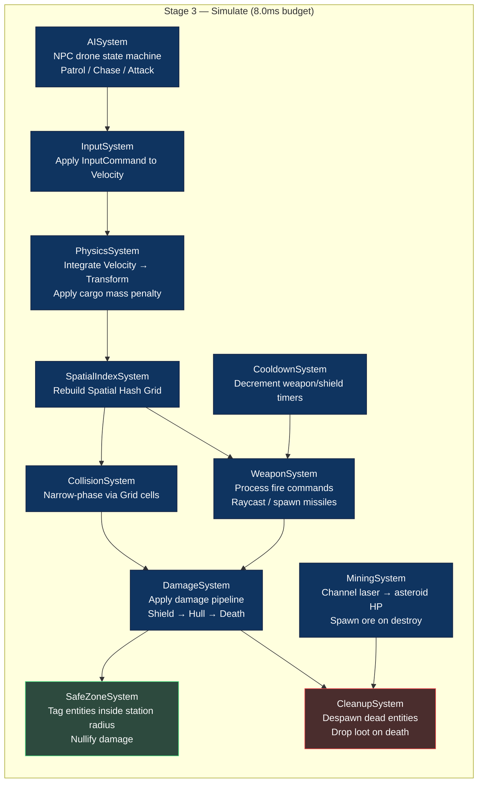
```mermaid
graph TD
    subgraph "Stage 3 — Simulate (8.0ms budget)"
        direction TB
        INPUT["InputSystem<br/>Apply InputCommand to Velocity"]
        PHYSICS["PhysicsSystem<br/>Integrate Velocity → Transform<br/>Apply cargo mass penalty"]
        SPATIAL["SpatialIndexSystem<br/>Rebuild Spatial Hash Grid"]
        COLLISION["CollisionSystem<br/>Narrow-phase via Grid cells"]
        WEAPON["WeaponSystem<br/>Process fire commands<br/>Raycast / spawn missiles"]
        DAMAGE["DamageSystem<br/>Apply damage pipeline<br/>Shield → Hull → Death"]
        MINING["MiningSystem<br/>Channel laser → asteroid HP<br/>Spawn ore on destroy"]
        AI_SYS["AISystem<br/>NPC drone state machine<br/>Patrol / Chase / Attack"]
        ZONE["SafeZoneSystem<br/>Tag entities inside station radius<br/>Nullify damage"]
        COOLDOWN["CooldownSystem<br/>Decrement weapon/shield timers"]
        CLEANUP["CleanupSystem<br/>Despawn dead entities<br/>Drop loot on death"]
    end

    INPUT --> PHYSICS
    PHYSICS --> SPATIAL
    SPATIAL --> COLLISION
    SPATIAL --> WEAPON
    COLLISION --> DAMAGE
    WEAPON --> DAMAGE
    DAMAGE --> ZONE
    AI_SYS --> INPUT
    MINING --> CLEANUP
    DAMAGE --> CLEANUP
    COOLDOWN --> WEAPON

    style INPUT fill:#0f3460,stroke:#16213e,color:#fff
    style PHYSICS fill:#0f3460,stroke:#16213e,color:#fff
    style SPATIAL fill:#0f3460,stroke:#16213e,color:#fff
    style COLLISION fill:#0f3460,stroke:#16213e,color:#fff
    style WEAPON fill:#0f3460,stroke:#16213e,color:#fff
    style DAMAGE fill:#0f3460,stroke:#16213e,color:#fff
    style MINING fill:#0f3460,stroke:#16213e,color:#fff
    style AI_SYS fill:#0f3460,stroke:#16213e,color:#fff
    style ZONE fill:#2d4a3e,stroke:#4ade80,color:#fff
    style COOLDOWN fill:#0f3460,stroke:#16213e,color:#fff
    style CLEANUP fill:#4a2d2d,stroke:#ef4444,color:#fff
```

### 6.4 System Dependency Graph

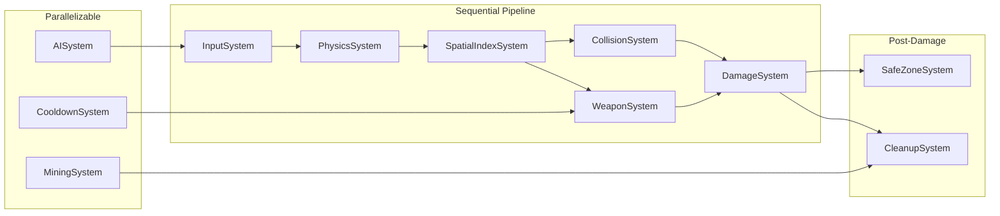
```mermaid
graph LR
    subgraph "Parallelizable"
        AI_SYS["AISystem"]
        COOLDOWN["CooldownSystem"]
        MINING["MiningSystem"]
    end

    subgraph "Sequential Pipeline"
        INPUT["InputSystem"] --> PHYSICS["PhysicsSystem"]
        PHYSICS --> SPATIAL["SpatialIndexSystem"]
        SPATIAL --> COLLISION["CollisionSystem"]
        SPATIAL --> WEAPON["WeaponSystem"]
        COLLISION --> DAMAGE["DamageSystem"]
        WEAPON --> DAMAGE
    end

    subgraph "Post-Damage"
        DAMAGE --> ZONE["SafeZoneSystem"]
        DAMAGE --> CLEANUP["CleanupSystem"]
    end

    AI_SYS --> INPUT
    COOLDOWN --> WEAPON
    MINING --> CLEANUP
```

---

## 7. Priority Channels — The Bandwidth Problem

Void Rush exercises the engine's **Priority Channel** system — a Kafka-inspired architecture that partitions the Data Plane into logically independent, priority-ranked channels. Under congestion or frame overrun, the server performs **priority shedding**: lower-priority channels are dropped or frequency-reduced while combat-critical data is preserved.

Priority Channels are a **differentiating engine feature**: developer-configurable via the `ChannelRegistry` builder API, bidirectional (both server→client and client→server traffic is prioritized), and dynamically shedable per-client. Void Rush uses the default 6-channel configuration; other games built on Aetheris can define entirely different channel topologies.

> Full specification: [PRIORITY_CHANNELS_DESIGN.md](PRIORITY_CHANNELS_DESIGN.md)

### 7.1 Why Void Rush Needs Priority Channels

With 1,000 players in a sector, the server must send ~8,400 bytes per tick per client (500 KB/s). Not all of that data has equal gameplay value:

- Losing your **own ship's position** update breaks client-side prediction immediately.
- Losing a **combat hit event** causes permanent HP desync.
- Losing a **distant asteroid's** HP update is invisible to the player.

Without prioritization, a WiFi micro-outage drops packets uniformly — there is equal probability of losing your damage event as losing a distant asteroid update. Priority Channels guarantee that combat-critical data survives.

### 7.2 Void Rush Channel Assignment

| Priority | Channel | Void Rush Content | Reliability | Shed Order |
|---|---|---|---|---|
| **P0** | `self` | Own ship Transform, Velocity, ShipStats | Unreliable (60Hz) | **Never** |
| **P1** | `combat` | BallisticEvents, DamageEvents, DeathEvents, MissileHit | Reliable | **Never** |
| **P2** | `nearby` | Ships + drones in same Spatial Grid cell (500m) | Unreliable (60Hz) | Last resort |
| **P3** | `distant` | Ships in adjacent Grid cells (1,500m) | Unreliable (30Hz default) | Third |
| **P4** | `environment` | Asteroid HP, loot drops, station broadcasts | Unreliable (on-change) | Second |
| **P5** | `cosmetic` | Laser VFX confirmations, chat, emotes | Unreliable / Reliable (chat) | **First** |

### 7.3 Shedding Behavior in Combat Scenarios

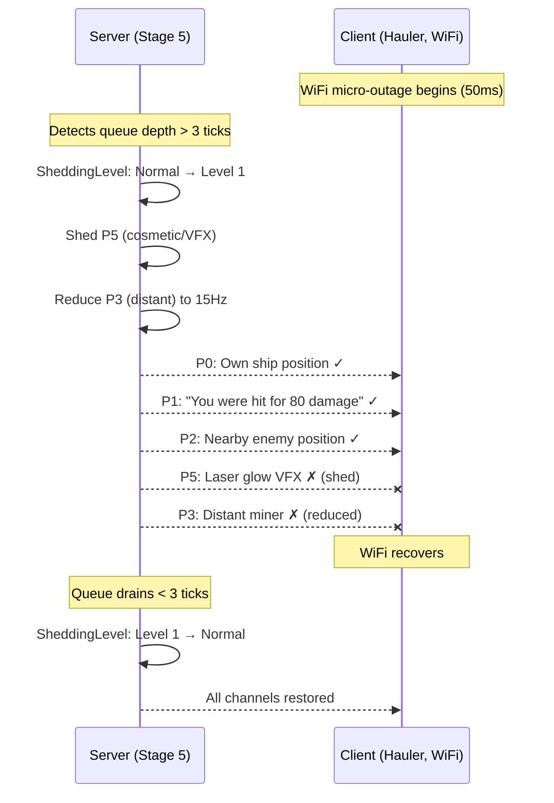
```mermaid
sequenceDiagram
    participant S as Server (Stage 5)
    participant C as Client (Hauler, WiFi)

    Note over C: WiFi micro-outage begins (50ms)
    Note over S: Detects queue depth > 3 ticks

    S->>S: SheddingLevel: Normal → Level 1
    S->>S: Shed P5 (cosmetic/VFX)
    S->>S: Reduce P3 (distant) to 15Hz

    S-->>C: P0: Own ship position ✓
    S-->>C: P1: "You were hit for 80 damage" ✓
    S-->>C: P2: Nearby enemy position ✓
    S--xC: P5: Laser glow VFX ✗ (shed)
    S--xC: P3: Distant miner ✗ (reduced)

    Note over C: WiFi recovers
    Note over S: Queue drains < 3 ticks

    S->>S: SheddingLevel: Level 1 → Normal
    S-->>C: All channels restored
```

### 7.4 Spatial Grid as Kafka Partition

Each Spatial Hash Grid cell acts as a **Kafka partition** — entities within it produce events, and clients "subscribe" to cells based on proximity. This reuses the same Grid built by the `SpatialIndexSystem` for collision detection, adding zero new spatial data structures.

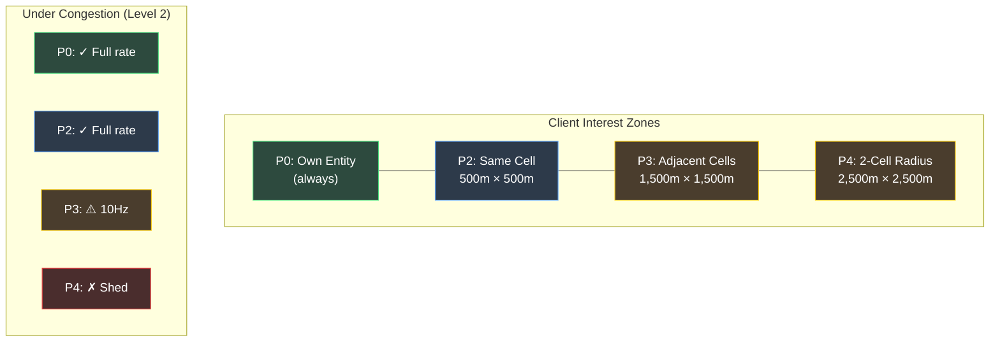
```mermaid
graph TD
    subgraph "Client Interest Zones"
        SELF["P0: Own Entity<br/>(always)"]
        CELL["P2: Same Cell<br/>500m × 500m"]
        ADJ["P3: Adjacent Cells<br/>1,500m × 1,500m"]
        FAR["P4: 2-Cell Radius<br/>2,500m × 2,500m"]
    end

    SELF --- CELL
    CELL --- ADJ
    ADJ --- FAR

    subgraph "Under Congestion (Level 2)"
        SELF2["P0: ✓ Full rate"]
        CELL2["P2: ✓ Full rate"]
        ADJ2["P3: ⚠️ 10Hz"]
        FAR2["P4: ✗ Shed"]
    end

    style SELF fill:#2d4a3e,stroke:#4ade80,color:#fff
    style CELL fill:#2d3a4a,stroke:#60a5fa,color:#fff
    style ADJ fill:#4a3d2d,stroke:#facc15,color:#fff
    style FAR fill:#4a3d2d,stroke:#facc15,color:#fff
    style SELF2 fill:#2d4a3e,stroke:#4ade80,color:#fff
    style CELL2 fill:#2d3a4a,stroke:#60a5fa,color:#fff
    style ADJ2 fill:#4a3d2d,stroke:#facc15,color:#fff
    style FAR2 fill:#4a2d2d,stroke:#ef4444,color:#fff
```

### 7.5 Bandwidth Impact

| Shedding Level | Active Channels | Est. Bandwidth/Client | Savings |
|---|---|---|---|
| **Normal** | P0–P5 | ~500 KB/s | — |
| **Level 1** | P0–P4 (P3 at 15Hz) | ~425 KB/s | 15% |
| **Level 2** | P0–P2, P3 at 10Hz | ~350 KB/s | 30% |
| **Level 3** | P0–P2 only | ~250 KB/s | 50% |

Freed bandwidth from shed channels is **reallocated upward** — P2 (nearby entities) gets more bytes per tick, increasing fidelity for combat-relevant entities.

---

## 8. Ballistic Replication — The Projectile Problem

### 8.1 The Problem

If 1,000 ships fire 10 lasers per second, the server generates **10,000 ephemeral entities per second**. Replicating position updates for all of them at 60 Hz would require:

$$
10{,}000 \text{ projectiles} \times 33 \text{ bytes/update} \times 60 \text{ Hz} = 19.8 \text{ MB/s outbound per client}
$$

This is **catastrophically infeasible** for browser WebTransport connections.

### 8.2 The Solution: Event-Driven Ballistic Replication

Projectiles are **never replicated as entities**. Instead, the server emits **deterministic fire events** via the reliable stream, and clients render projectiles locally using shared physics.

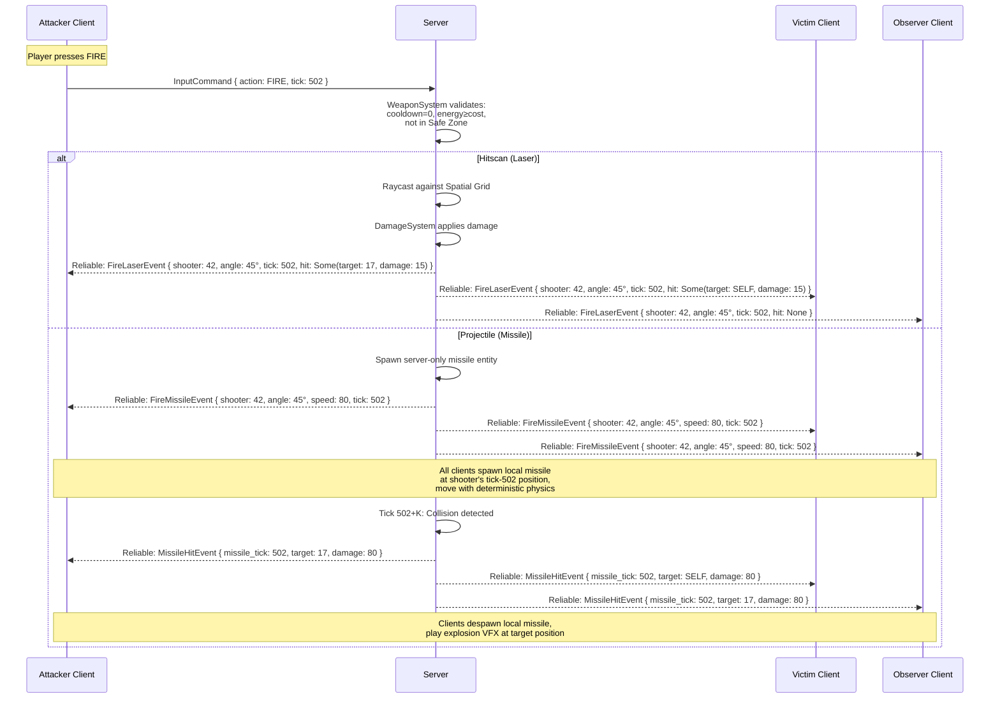
```mermaid
sequenceDiagram
    participant A as Attacker Client
    participant S as Server
    participant V as Victim Client
    participant O as Observer Client

    Note over A: Player presses FIRE
    A->>S: InputCommand { action: FIRE, tick: 502 }

    S->>S: WeaponSystem validates:<br/>cooldown=0, energy≥cost,<br/>not in Safe Zone

    alt Hitscan (Laser)
        S->>S: Raycast against Spatial Grid
        S->>S: DamageSystem applies damage
        S-->>A: Reliable: FireLaserEvent { shooter: 42, angle: 45°, tick: 502, hit: Some(target: 17, damage: 15) }
        S-->>V: Reliable: FireLaserEvent { shooter: 42, angle: 45°, tick: 502, hit: Some(target: SELF, damage: 15) }
        S-->>O: Reliable: FireLaserEvent { shooter: 42, angle: 45°, tick: 502, hit: None }
    else Projectile (Missile)
        S->>S: Spawn server-only missile entity
        S-->>A: Reliable: FireMissileEvent { shooter: 42, angle: 45°, speed: 80, tick: 502 }
        S-->>V: Reliable: FireMissileEvent { shooter: 42, angle: 45°, speed: 80, tick: 502 }
        S-->>O: Reliable: FireMissileEvent { shooter: 42, angle: 45°, speed: 80, tick: 502 }
        Note over A,O: All clients spawn local missile<br/>at shooter's tick-502 position,<br/>move with deterministic physics
        S->>S: Tick 502+K: Collision detected
        S-->>A: Reliable: MissileHitEvent { missile_tick: 502, target: 17, damage: 80 }
        S-->>V: Reliable: MissileHitEvent { missile_tick: 502, target: SELF, damage: 80 }
        S-->>O: Reliable: MissileHitEvent { missile_tick: 502, target: 17, damage: 80 }
        Note over A,O: Clients despawn local missile,<br/>play explosion VFX at target position
    end
```

### 8.3 Event Definitions

```rust
/// Sent via reliable stream. Clients render locally.
pub enum BallisticEvent {
    /// Instant-hit weapon. Client draws beam VFX from shooter to hit point.
    FireLaser {
        shooter_id: NetworkId,
        angle: f32,
        tick: u64,
        hit: Option<LaserHit>,
    },
    /// Tracking projectile. Client spawns local entity with deterministic physics.
    FireMissile {
        shooter_id: NetworkId,
        angle: f32,
        speed: f32,
        tick: u64,
    },
    /// Server confirms missile collision. Client despawns local projectile.
    MissileHit {
        missile_origin_tick: u64,
        shooter_id: NetworkId,
        target_id: NetworkId,
        damage: u32,
    },
    /// Missile expired (max range). Client despawns silently.
    MissileExpired {
        missile_origin_tick: u64,
        shooter_id: NetworkId,
    },
}

pub struct LaserHit {
    pub target_id: NetworkId,
    pub damage: u32,
    pub hit_point: (f32, f32, f32),
}
```

### 8.4 Bandwidth Impact

| Approach | Per-Projectile/Tick | 10K Projectiles @ 60Hz | Feasible? |
|---|---|---|---|
| **Full entity replication** | 33 bytes | 19.8 MB/s per client | No |
| **Event-driven (fire + hit)** | ~24 bytes (one-time) | ~240 KB/s total burst | **Yes** |

---

## 9. Spatial Partitioning — The Collision Problem

### 9.1 The Problem

Brute-force collision detection in a sector with $N$ entities requires $O(N^2)$ pairwise checks:

$$
\binom{6700}{2} = \frac{6700 \times 6699}{2} \approx 22.4 \text{ million checks per tick}
$$

At 60 Hz, this consumes the entire tick budget before any game logic runs.

### 9.2 The Solution: Spatial Hash Grid

A **Spatial Hash Grid** divides the world into fixed-size cells. Entities register in the cell(s) they overlap. Collision checks only occur between entities sharing a cell.

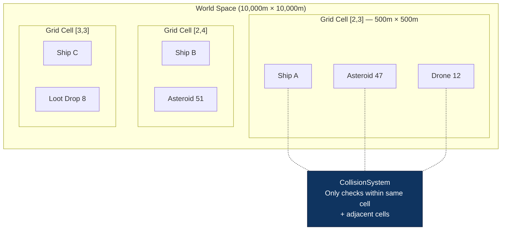
```mermaid
graph TD
    subgraph "World Space (10,000m × 10,000m)"
        direction TB
        subgraph "Grid Cell [2,3] — 500m × 500m"
            E1["Ship A"]
            E2["Asteroid 47"]
            E3["Drone 12"]
        end
        subgraph "Grid Cell [2,4]"
            E4["Ship B"]
            E5["Asteroid 51"]
        end
        subgraph "Grid Cell [3,3]"
            E6["Ship C"]
            E7["Loot Drop 8"]
        end
    end

    CHECK["CollisionSystem<br/>Only checks within same cell<br/>+ adjacent cells"]

    E1 -.- CHECK
    E2 -.- CHECK
    E3 -.- CHECK

    style CHECK fill:#0f3460,stroke:#16213e,color:#fff
```

### 9.3 Grid Configuration

| Parameter | Value | Rationale |
|---|---|---|
| **Cell Size** | 500m × 500m | Largest weapon range (missile: 500m) fits within one cell |
| **Grid Extent** | 20 × 20 cells (10km × 10km) | Sufficient for MVP sector size |
| **Storage** | `HashMap<(i32, i32), Vec<EntityRef>>` | Sparse — only populated cells allocate |
| **Rebuild** | Full rebuild every tick | Simpler than incremental; 6,700 entities × hash = ~0.2ms |

### 9.4 Collision Pipeline

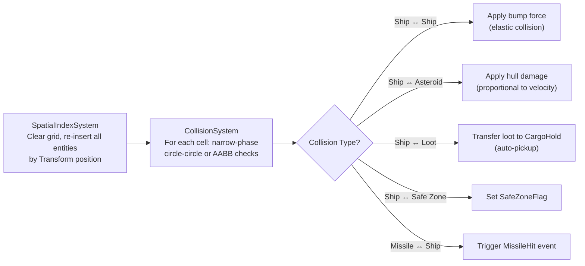
```mermaid
graph LR
    A["SpatialIndexSystem<br/>Clear grid, re-insert all entities<br/>by Transform position"] --> B["CollisionSystem<br/>For each cell: narrow-phase<br/>circle-circle or AABB checks"]
    B --> C{"Collision Type?"}
    C -->|"Ship ↔ Ship"| D["Apply bump force<br/>(elastic collision)"]
    C -->|"Ship ↔ Asteroid"| E["Apply hull damage<br/>(proportional to velocity)"]
    C -->|"Ship ↔ Loot"| F["Transfer loot to CargoHold<br/>(auto-pickup)"]
    C -->|"Ship ↔ Safe Zone"| G["Set SafeZoneFlag"]
    C -->|"Missile ↔ Ship"| H["Trigger MissileHit event"]
```

### 9.5 Complexity Comparison

| Approach | Checks/Tick (6,700 entities) | Time Estimate |
|---|---|---|
| **Brute-force** $O(N^2)$ | 22.4 million | ~50ms (over budget) |
| **Spatial Hash** $O(N \times K)$ | ~67,000 (avg 10 per cell) | ~0.5ms |

Where $K$ is the average number of entities per cell (including neighbors).

> **Canonical Source:** See [SPATIAL_PARTITIONING_DESIGN.md](SPATIAL_PARTITIONING_DESIGN.md) for the engine-level spatial hash grid design, `SpatialIndex` trait, AoI model, and cell transition protocol that generalize the Void Rush spatial system to all applications.

---

## 10. Inertial Interpolation — The Visual Problem

### 10.1 The Problem

Newtonian flight means ships **slide**. Unlike ground-based games where stopped characters stay put, space ships in Void Rush maintain velocity indefinitely. When a network packet is late or dropped, the enemy ship on screen appears to:

1. **Freeze** (if rendering only confirmed server state)
2. **Teleport** (if snapping to the next received position)

Both break immersion and make combat impossible.

### 10.2 The Solution: Dead Reckoning + Interpolation

The Render Worker uses a **two-phase** smoothing pipeline:

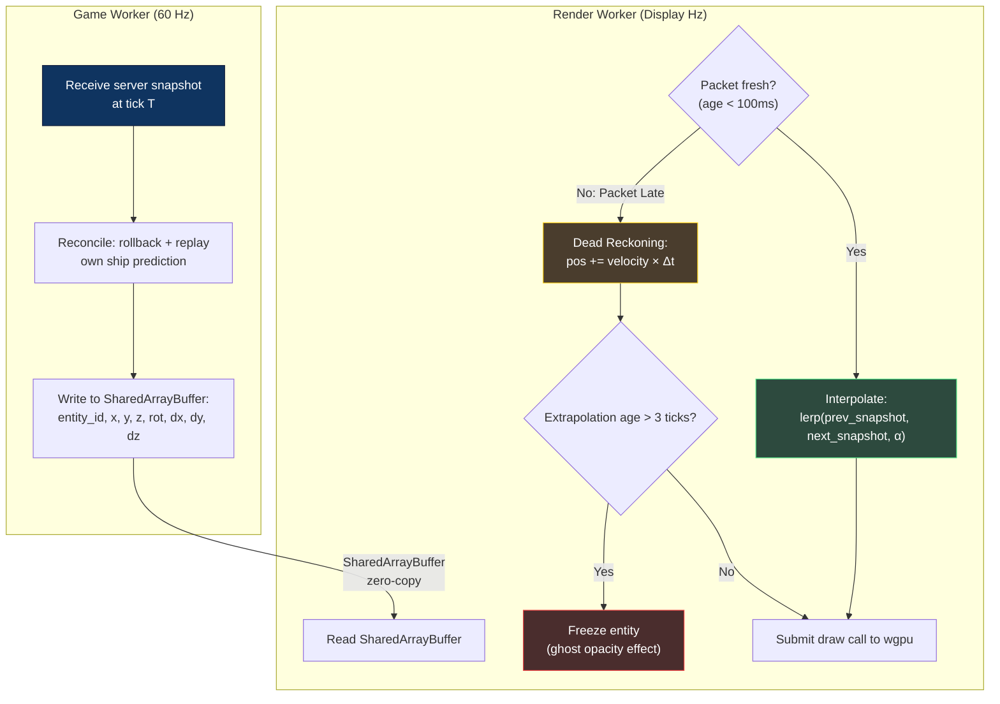
```mermaid
graph TD
    subgraph "Game Worker (60 Hz)"
        RECV["Receive server snapshot<br/>at tick T"]
        RECON["Reconcile: rollback + replay<br/>own ship prediction"]
        WRITE["Write to SharedArrayBuffer:<br/>entity_id, x, y, z, rot, dx, dy, dz"]
    end

    subgraph "Render Worker (Display Hz)"
        READ["Read SharedArrayBuffer"]
        INTERP{"Packet fresh?<br/>(age < 100ms)"}
        INTERP -->|Yes| LERP["Interpolate:<br/>lerp(prev_snapshot, next_snapshot, α)"]
        INTERP -->|No: Packet Late| DR["Dead Reckoning:<br/>pos += velocity × Δt"]
        DR --> STALE{"Extrapolation age > 3 ticks?"}
        STALE -->|Yes| FREEZE["Freeze entity<br/>(ghost opacity effect)"]
        STALE -->|No| RENDER
        LERP --> RENDER["Submit draw call to wgpu"]
    end

    RECV --> RECON --> WRITE
    WRITE -->|"SharedArrayBuffer<br/>zero-copy"| READ

    style RECV fill:#0f3460,stroke:#16213e,color:#fff
    style LERP fill:#2d4a3e,stroke:#4ade80,color:#fff
    style DR fill:#4a3d2d,stroke:#facc15,color:#fff
    style FREEZE fill:#4a2d2d,stroke:#ef4444,color:#fff
```

### 10.3 Interpolation Math

For smooth rendering between two server snapshots $S_n$ and $S_{n+1}$ received at server ticks $T_n$ and $T_{n+1}$:

$$
\alpha = \frac{t_{render} - T_n}{T_{n+1} - T_n}
$$

$$
\text{pos}_{render} = \text{pos}_{S_n} \times (1 - \alpha) + \text{pos}_{S_{n+1}} \times \alpha
$$

The render loop operates at display refresh rate (60–144 Hz) with a **100ms interpolation delay buffer**, ensuring 6+ server ticks of lookahead are always available.

### 10.4 Dead Reckoning (Extrapolation on Packet Loss)

When no new snapshot arrives, extrapolate using last known velocity:

$$
\text{pos}_{extrapolated}(t) = \text{pos}_{last} + \text{vel}_{last} \times (t - T_{last})
$$

**Safeguards:**

- Maximum extrapolation window: **3 ticks** (50ms)
- After 3 ticks without update: entity renders with "ghost" transparency effect
- After 10 ticks: entity frozen entirely (server likely lost connection)

### 10.5 Snap Correction (Reconciliation Smoothing)

When a delayed packet arrives and the entity has drifted from its dead-reckoned position:

$$
\Delta = |\text{pos}_{predicted} - \text{pos}_{server}|
$$

| Divergence ($\Delta$) | Action |
|---|---|
| $\Delta < 0.5\text{m}$ | Smooth lerp over 5 frames |
| $0.5\text{m} \leq \Delta < 10\text{m}$ | Accelerated lerp over 3 frames |
| $\Delta \geq 10\text{m}$ | Hard teleport (client was clearly wrong) |

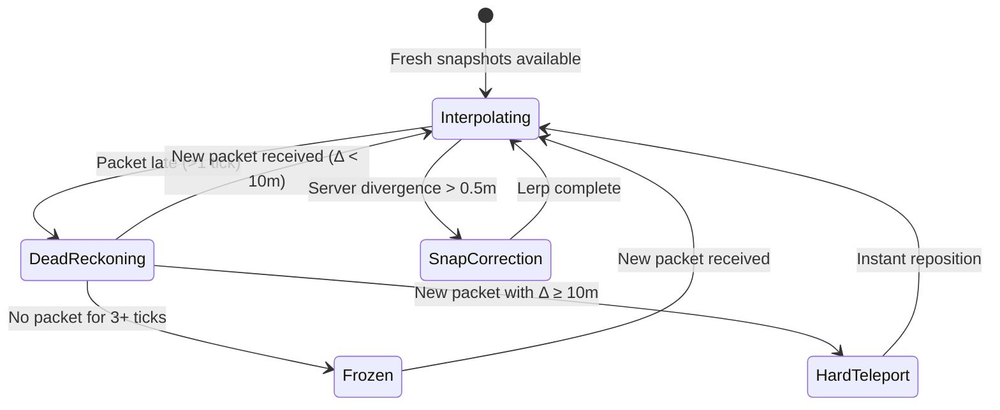
```mermaid
stateDiagram-v2
    [*] --> Interpolating: Fresh snapshots available

    Interpolating --> DeadReckoning: Packet late (>1 tick)
    DeadReckoning --> Interpolating: New packet received (Δ < 10m)
    DeadReckoning --> Frozen: No packet for 3+ ticks
    Frozen --> Interpolating: New packet received

    Interpolating --> SnapCorrection: Server divergence > 0.5m
    SnapCorrection --> Interpolating: Lerp complete

    DeadReckoning --> HardTeleport: New packet with Δ ≥ 10m
    HardTeleport --> Interpolating: Instant reposition
```

---

## 11. Transactional Economy — The Zero-Trust Test

### 11.1 The Problem

When a player docks at a Station and clicks **"Sell 500 Ore for 5,000 Credits"**, the system must guarantee:

1. The player **actually has** 500 ore (not spoofed by a modified client)
2. The credit balance is updated **atomically** (no duplication exploits)
3. The transaction is **permanently recorded** in the event ledger
4. The Merkle chain for this entity's wallet is **unbroken**

This is the stress test for the entire Zero-Trust + Persistence stack.

### 11.2 Transaction Flow

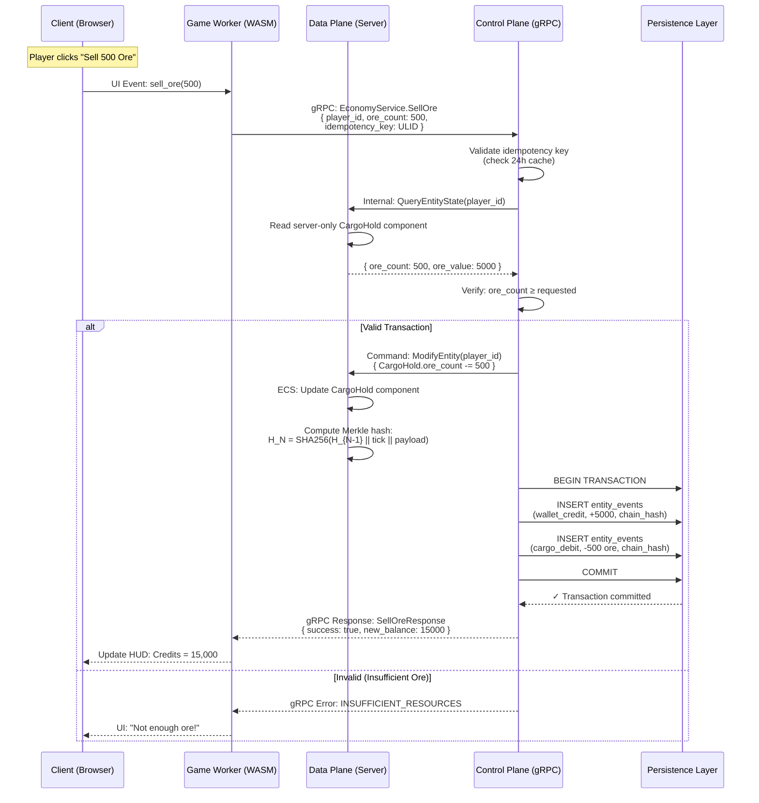
```mermaid
sequenceDiagram
    participant C as Client (Browser)
    participant GP as Game Worker (WASM)
    participant DP as Data Plane (Server)
    participant CP as Control Plane (gRPC)
    participant DB as Persistence Layer

    Note over C: Player clicks "Sell 500 Ore"
    C->>GP: UI Event: sell_ore(500)
    GP->>CP: gRPC: EconomyService.SellOre<br/>{ player_id, ore_count: 500,<br/>  idempotency_key: ULID }

    CP->>CP: Validate idempotency key<br/>(check 24h cache)

    CP->>DP: Internal: QueryEntityState(player_id)
    DP->>DP: Read server-only CargoHold component
    DP-->>CP: { ore_count: 500, ore_value: 5000 }

    CP->>CP: Verify: ore_count ≥ requested

    alt Valid Transaction
        CP->>DP: Command: ModifyEntity(player_id)<br/>{ CargoHold.ore_count -= 500 }
        DP->>DP: ECS: Update CargoHold component
        DP->>DP: Compute Merkle hash:<br/>H_N = SHA256(H_{N-1} || tick || payload)

        CP->>DB: BEGIN TRANSACTION
        CP->>DB: INSERT entity_events<br/>(wallet_credit, +5000, chain_hash)
        CP->>DB: INSERT entity_events<br/>(cargo_debit, -500 ore, chain_hash)
        CP->>DB: COMMIT

        DB-->>CP: ✓ Transaction committed

        CP-->>GP: gRPC Response: SellOreResponse<br/>{ success: true, new_balance: 15000 }
        GP-->>C: Update HUD: Credits = 15,000

    else Invalid (Insufficient Ore)
        CP-->>GP: gRPC Error: INSUFFICIENT_RESOURCES
        GP-->>C: UI: "Not enough ore!"
    end
```

### 11.3 Zero-Trust Hash Verification

Every wallet mutation extends the entity's **Merkle chain**:

```mermaid
graph LR
    H0["H₀<br/>Genesis Hash<br/>(account creation)"] --> H1["H₁ = SHA256(H₀ || tick₁ || +1000cr)<br/>Initial credits"]
    H1 --> H2["H₂ = SHA256(H₁ || tick₂ || -200cr)<br/>Buy Interceptor"]
    H2 --> H3["H₃ = SHA256(H₂ || tick₃ || +5000cr)<br/>Sell 500 ore"]
    H3 --> H4["H₄ = SHA256(H₃ || tick₄ || -150cr)<br/>Repair hull"]

    style H0 fill:#0f3460,stroke:#16213e,color:#fff
    style H3 fill:#2d4a3e,stroke:#4ade80,color:#fff
```

**Audit Worker** (asynchronous, outside tick pipeline) periodically:

1. Reads Cold Tier event ledger for entity
2. Recomputes Merkle chain from genesis
3. Compares final hash against live `MerkleChainState` component
4. **CHAIN_BREACH** on mismatch → alert, potential rollback

### 11.4 Data Temperature Mapping for Economy

```mermaid
graph TD
    subgraph "🔥 Boiling — ECS In-Memory"
        CARGO["CargoHold { ore: 500 }"]
        WALLET_ECS["Wallet { credits: 15000 }"]
    end

    subgraph "🌶️ Hot — Redis"
        SESSION["Session: player_42<br/>sector: kepler<br/>docked: true"]
        IDEMP["Idempotency Cache<br/>key → result (24h TTL)"]
    end

    subgraph "☀️ Warm — PostgreSQL"
        SNAPSHOT["Player Snapshot<br/>(hourly checkpoint)"]
        INVENTORY["Inventory Table<br/>(loadout, upgrades)"]
    end

    subgraph "❄️ Cold — TimescaleDB"
        EVENTS["entity_events<br/>append-only ledger<br/>chain_hash verified"]
    end

    CARGO -->|"Persistence Sink<br/>(async mpsc)"| EVENTS
    WALLET_ECS -->|"Persistence Sink"| EVENTS
    EVENTS -->|"Hourly aggregation"| SNAPSHOT

    style CARGO fill:#4a2d2d,stroke:#ef4444,color:#fff
    style WALLET_ECS fill:#4a2d2d,stroke:#ef4444,color:#fff
    style SESSION fill:#4a3d2d,stroke:#facc15,color:#fff
    style EVENTS fill:#2d3a4a,stroke:#60a5fa,color:#fff
    style SNAPSHOT fill:#2d4a3e,stroke:#4ade80,color:#fff
```

### 11.5 Idempotency Guarantee

All economy RPCs carry a client-generated `idempotency_key` (ULID). If the client retransmits (e.g., due to timeout), the server returns the **cached result** without re-executing the transaction.

```rust
pub struct SellOreRequest {
    pub player_id: u64,
    pub ore_count: u32,
    pub idempotency_key: String,  // ULID, client-generated
}

pub struct SellOreResponse {
    pub success: bool,
    pub credits_earned: u64,
    pub new_balance: u64,
    pub transaction_id: String,   // Server-generated UUIDv7
}
```

---

## 12. Client Rendering Pipeline

### 12.1 Three-Worker Architecture for Void Rush

```mermaid
graph TD
    subgraph "Main Thread (DOM)"
        DOM["HTML Canvas<br/>+ HUD Overlay"]
        INPUT["Input Listener<br/>WASD, Mouse, Touch"]
        HUD["HUD State<br/>HP Bar, Credits, Minimap"]
    end

    subgraph "Game Worker (WASM + WebTransport)"
        NET["WebTransport Bridge<br/>Receive server snapshots"]
        PREDICT["Client-Side Prediction<br/>Apply own InputCommand locally"]
        RECON["Reconciliation<br/>Rollback + Replay on server correction"]
        EVENT["Ballistic Event Handler<br/>Spawn/despawn local projectiles"]
        SAB_W["SharedArrayBuffer Writer<br/>Entity table: [id, x, y, z, rot, dx, dy, dz, hp, ...]"]
    end

    subgraph "Render Worker (wgpu + OffscreenCanvas)"
        SAB_R["SharedArrayBuffer Reader"]
        INTERP["Interpolation Engine<br/>lerp(prev, next, α)"]
        DR["Dead Reckoning<br/>Extrapolate on packet loss"]
        VFX["VFX System<br/>Laser beams, explosions, shields"]
        GPU["wgpu Draw Calls<br/>Submit to OffscreenCanvas"]
    end

    INPUT -->|"postMessage"| PREDICT
    NET --> RECON
    NET --> EVENT
    RECON --> SAB_W
    EVENT --> SAB_W
    SAB_W -->|"SharedArrayBuffer<br/>zero-copy"| SAB_R
    SAB_R --> INTERP
    SAB_R --> DR
    INTERP --> VFX
    DR --> VFX
    VFX --> GPU
    GPU -->|"OffscreenCanvas"| DOM
    PREDICT -->|"postMessage"| HUD

    style NET fill:#0f3460,stroke:#16213e,color:#fff
    style PREDICT fill:#0f3460,stroke:#16213e,color:#fff
    style GPU fill:#3d2d4a,stroke:#a78bfa,color:#fff
```

### 12.2 SharedArrayBuffer Entity Layout

Each entity occupies a fixed-size slot in the shared buffer:

| Offset | Field | Type | Size |
|---|---|---|---|
| 0 | `network_id` | `u64` | 8 bytes |
| 8 | `x` | `f32` | 4 bytes |
| 12 | `y` | `f32` | 4 bytes |
| 16 | `z` | `f32` | 4 bytes |
| 20 | `rotation` | `f32` | 4 bytes |
| 24 | `dx` | `f32` | 4 bytes |
| 28 | `dy` | `f32` | 4 bytes |
| 32 | `dz` | `f32` | 4 bytes |
| 36 | `hp` | `u16` | 2 bytes |
| 38 | `shield` | `u16` | 2 bytes |
| 40 | `entity_type` | `u8` | 1 byte |
| 41 | `flags` | `u8` | 1 byte |
| 42 | `_padding` | — | 6 bytes |
| **Total** | — | — | **48 bytes/entity** |

**Buffer capacity:** 8,192 entity slots × 48 bytes = **384 KB** (fits comfortably in L2 cache).

> **Canonical Source:** See [WORKER_COMMUNICATION_DESIGN.md](WORKER_COMMUNICATION_DESIGN.md) for the engine-level SAB protocol, double-buffer flip-bit specification, extensible region model, and the full `EntityDisplayState` repr(C) struct.

### 12.3 Visual Asset List (MVP)

| Asset | Type | Polygon Budget | Notes |
|---|---|---|---|
| Interceptor | 3D Mesh | ~500 tris | Sleek, angular |
| Dreadnought | 3D Mesh | ~1,200 tris | Bulky, many turret hardpoints |
| Hauler | 3D Mesh | ~800 tris | Boxy, visible cargo bay |
| Asteroid (small) | 3D Mesh | ~200 tris | Instanced, 5 variants |
| Asteroid (large) | 3D Mesh | ~600 tris | Instanced, 3 variants |
| Station | 3D Mesh | ~2,000 tris | 1 per sector, static |
| Alien Drone | 3D Mesh | ~400 tris | Insectoid silhouette |
| Laser Beam | Procedural VFX | — | Line + glow shader |
| Missile | Billboard sprite | — | Animated trail particles |
| Explosion | Particle system | — | 32 particles, 0.5s lifetime |
| Shield Hit | Procedural VFX | — | Hemisphere flash shader |
| Starfield | Skybox | — | Procedural star shader |

---

## 13. Control Plane Integration

### 13.1 gRPC Service Mapping

Void Rush requires the following Control Plane services:

```mermaid
graph TD
    subgraph "Control Plane (gRPC — Port 50051)"
        AUTH["AuthService<br/>Login, JWT, QUIC token"]
        MATCH["MatchmakingService<br/>Sector assignment"]
        ECON["EconomyService<br/>Buy/Sell transactions"]
        INV["InventoryService<br/>Loadout management"]
        LEAD["LeaderboardService<br/>Rankings aggregation"]
    end

    subgraph "Client (Browser)"
        LOGIN["Login Screen"]
        LOBBY["Sector Select"]
        DOCK["Docking UI"]
        SHOP["Upgrade Shop"]
        BOARD["Leaderboard Panel"]
    end

    LOGIN -->|"gRPC-Web"| AUTH
    LOBBY -->|"gRPC-Web"| MATCH
    DOCK -->|"gRPC-Web"| ECON
    SHOP -->|"gRPC-Web"| INV
    BOARD -->|"gRPC-Web"| LEAD

    AUTH -->|"JWT + QUIC Token"| DP["Data Plane<br/>WebTransport Connection"]

    style AUTH fill:#0f3460,stroke:#16213e,color:#fff
    style MATCH fill:#0f3460,stroke:#16213e,color:#fff
    style ECON fill:#2d4a3e,stroke:#4ade80,color:#fff
    style INV fill:#2d4a3e,stroke:#4ade80,color:#fff
    style LEAD fill:#3d2d4a,stroke:#a78bfa,color:#fff
```

### 13.2 Auth & Connection Flow

```mermaid
sequenceDiagram
    participant B as Browser
    participant CP as Control Plane (gRPC)
    participant DP as Data Plane (WebTransport)

    B->>CP: AuthService.Login { username, password_hash }
    CP->>CP: Verify Argon2id hash
    CP-->>B: LoginResponse { jwt (1h TTL), player_id }

    B->>CP: MatchmakingService.JoinSector { jwt, sector_id: "kepler" }
    CP->>CP: Validate JWT, check sector capacity
    CP->>DP: Internal: Reserve slot for player_id
    CP-->>B: JoinSectorResponse { quic_token (30s TTL), server_addr }

    B->>DP: WebTransport.connect(server_addr, quic_token)
    DP->>DP: Verify HMAC on quic_token (no DB call)
    DP-->>B: Connection established

    DP->>DP: Spawn player entity in ECS
    DP-->>B: Reliable: Welcome { network_id, sector_state_snapshot }

    Note over B: Game loop begins
```

### 13.3 Protobuf Definitions (Key Messages)

```protobuf
// economy.proto
service EconomyService {
  rpc SellOre(SellOreRequest) returns (SellOreResponse);
  rpc BuyItem(BuyItemRequest) returns (BuyItemResponse);
  rpc GetBalance(GetBalanceRequest) returns (GetBalanceResponse);
}

message SellOreRequest {
  uint64 player_id = 1;
  uint32 ore_count = 2;
  string idempotency_key = 3;
}

message SellOreResponse {
  bool success = 1;
  uint64 credits_earned = 2;
  uint64 new_balance = 3;
  string transaction_id = 4;
}

// inventory.proto
service InventoryService {
  rpc EquipLoadout(EquipLoadoutRequest) returns (EquipLoadoutResponse);
  rpc GetInventory(GetInventoryRequest) returns (GetInventoryResponse);
}

message EquipLoadoutRequest {
  uint64 player_id = 1;
  uint32 weapon_id = 2;
  uint32 hull_id = 3;
  uint32 engine_id = 4;
  uint32 shield_id = 5;
  string idempotency_key = 6;
}
```

---

## 14. Anti-Cheat & Security Model

### 14.1 Threat Model for Void Rush

| Threat | Attack Vector | Impact | Mitigation |
|---|---|---|---|
| **Speed hack** | Modified client sends impossibly high velocity | Unfair advantage in PvP/escape | Server validates velocity against `ShipStats` + mass |
| **Teleport hack** | Client claims position far from server state | Skip danger zones, instant docking | Server rejects position jumps > threshold |
| **Ore duplication** | Replay or forge sell transactions | Infinite credits, economy collapse | Idempotency keys + Merkle chain audit |
| **Cargo spoofing** | Client claims more ore than held | Free credits | `CargoHold` is server-only component |
| **Wallhack / ESP** | Read other players' cargo from wire | Target high-value haulers | Cargo data never replicated to clients |
| **Auto-aim bot** | Modified client with perfect targeting | Unfair PvP advantage | Statistical detection via `SuspicionScore` |

### 14.2 Server-Authority Enforcement

```mermaid
graph TD
    subgraph "Client-Side (Untrusted)"
        INPUT["InputCommand<br/>{move_dir, action, look_dir}"]
    end

    subgraph "Server-Side (Trusted)"
        VALIDATE["Input Validation<br/>Rate limit, range check"]
        PHYSICS_S["PhysicsSystem<br/>Server computes actual position"]
        DAMAGE_S["DamageSystem<br/>Server computes actual damage"]
        ECON_S["EconomyService<br/>Server verifies balances"]
    end

    subgraph "Anti-Cheat Systems"
        ANOMALY["Anomaly Detection<br/>Impossible velocity?<br/>Fire rate violation?<br/>Position discontinuity?"]
        SCORE["SuspicionScore<br/>0-255 per entity"]
        AUDIT["Audit Worker<br/>Merkle chain verification"]
        ACTION["Response Actions"]
    end

    INPUT --> VALIDATE
    VALIDATE --> PHYSICS_S
    VALIDATE --> DAMAGE_S

    PHYSICS_S --> ANOMALY
    DAMAGE_S --> ANOMALY

    ANOMALY -->|"anomaly detected"| SCORE
    SCORE -->|"score > 200"| ACTION
    ECON_S --> AUDIT

    ACTION --> THROTTLE["Throttle: reduce tick rate"]
    ACTION --> SHADOW["Shadow ban: hide from matchmaking"]
    ACTION --> KICK["Kick: disconnect + log"]

    style INPUT fill:#4a2d2d,stroke:#ef4444,color:#fff
    style VALIDATE fill:#0f3460,stroke:#16213e,color:#fff
    style ANOMALY fill:#4a3d2d,stroke:#facc15,color:#fff
    style SCORE fill:#4a3d2d,stroke:#facc15,color:#fff
```

### 14.3 Velocity Validation Rules

```rust
fn validate_velocity(
    velocity: &Velocity,
    ship_stats: &ShipStats,
    cargo: &CargoHold,
    loadout: &Loadout,
) -> bool {
    let max_speed = get_max_speed(loadout.engine_id);
    let effective_mass = get_hull_mass(loadout.hull_id)
        + (cargo.ore_count as f32 * ORE_MASS_PER_UNIT);
    let max_accel = get_thrust(loadout.engine_id) / effective_mass;

    let current_speed = (velocity.dx.powi(2) + velocity.dy.powi(2) + velocity.dz.powi(2)).sqrt();

    // Hard cap: speed cannot exceed ship's max + 10% tolerance
    current_speed <= max_speed * 1.10
}
```

---

## 15. Phased Delivery Roadmap

### 15.1 Phase 1 — MVP Milestone Map

```mermaid
gantt
    title Void Rush — Phase 1 MVP Delivery
    dateFormat  YYYY-MM-DD
    axisFormat  %b %Y

    section Engine Foundation
    ECS Components (Void Rush)          :vr1, 2026-05-01, 21d
    Spatial Hash Grid                   :vr2, after vr1, 14d
    Ballistic Event System              :vr3, after vr1, 14d
    Inertial Dead Reckoning             :vr4, after vr1, 14d

    section Game Systems
    Ship Physics (mass + inertia)       :vr5, after vr2, 14d
    Weapon Systems (laser + missile)    :vr6, after vr3, 14d
    Mining System                       :vr7, after vr5, 10d
    Safe Zone Enforcement               :vr8, after vr5, 7d
    NPC Drone AI                        :vr9, after vr5, 14d
    Damage + Death + Respawn            :vr10, after vr6, 10d

    section Economy
    EconomyService (gRPC)               :vr11, after vr8, 14d
    InventoryService (gRPC)             :vr12, after vr8, 14d
    Wallet + Merkle Chain               :vr13, after vr11, 10d

    section Client
    Ship Rendering (wgpu)               :vr14, 2026-05-01, 28d
    Asteroid Field Rendering            :vr15, after vr14, 14d
    HUD (HP, credits, minimap)          :vr16, after vr14, 14d
    Docking UI                          :vr17, after vr11, 10d
    VFX (lasers, explosions)            :vr18, after vr15, 14d

    section Integration
    Stress Test (500 bots)              :vr19, after vr10, 14d
    Stress Test (1000 bots)             :vr20, after vr19, 7d
    Bug Bash + Polish                   :vr21, after vr20, 14d
    MVP Launch                          :milestone, after vr21, 0d
```

### 15.2 Phase Dependency Map

```mermaid
graph TD
    subgraph "Phase 1 — Prove the Engine"
        P1_ECS["ECS Components"]
        P1_SPATIAL["Spatial Hash Grid"]
        P1_BALLISTIC["Ballistic Events"]
        P1_PHYSICS["Ship Physics"]
        P1_COMBAT["Combat Systems"]
        P1_MINING["Mining System"]
        P1_ECON["Economy Service"]
        P1_CLIENT["Client Rendering"]
        P1_STRESS["Stress Test 1K"]
    end

    subgraph "Phase 2 — Stress the Economy"
        P2_MULTI_ORE["Multi-Ore Types"]
        P2_CRAFT["Crafting System"]
        P2_AUCTION["Auction House"]
        P2_NPC_FACTION["NPC Factions"]
        P2_STRESS["Stress Test 2.5K"]
    end

    subgraph "Phase 3+ — Break the Boundaries"
        P3_GUILD["Guild System"]
        P3_TERRITORY["Territory Control"]
        P3_CAPITAL["Capital Ships"]
        P3_FEDERATION["Federation / Seamless"]
        P3_CUSTOM_ECS["Custom ECS (BitVec)"]
    end

    P1_ECS --> P1_SPATIAL
    P1_ECS --> P1_BALLISTIC
    P1_SPATIAL --> P1_PHYSICS
    P1_SPATIAL --> P1_COMBAT
    P1_PHYSICS --> P1_MINING
    P1_COMBAT --> P1_ECON
    P1_MINING --> P1_ECON
    P1_ECS --> P1_CLIENT
    P1_ECON --> P1_STRESS

    P1_STRESS --> P2_MULTI_ORE
    P1_ECON --> P2_AUCTION
    P2_MULTI_ORE --> P2_CRAFT
    P2_CRAFT --> P2_AUCTION
    P1_COMBAT --> P2_NPC_FACTION
    P2_AUCTION --> P2_STRESS

    P2_STRESS --> P3_GUILD
    P3_GUILD --> P3_TERRITORY
    P3_TERRITORY --> P3_CAPITAL
    P2_STRESS --> P3_FEDERATION
    P2_STRESS --> P3_CUSTOM_ECS

    style P1_STRESS fill:#2d4a3e,stroke:#4ade80,color:#fff
    style P2_STRESS fill:#2d3a4a,stroke:#60a5fa,color:#fff
    style P3_FEDERATION fill:#3d2d4a,stroke:#a78bfa,color:#fff
```

---

## 16. Performance Contracts

### 16.1 Server-Side Targets

| Metric | Target | Measurement Method |
|---|---|---|
| **Tick rate** | Stable 60 Hz (16.6ms budget) | `TickScheduler` histogram (P99) |
| **Stage 3 (Simulate)** | ≤ 8.0ms with 1,000 players | `simulate_duration_ms` metric |
| **Spatial Grid rebuild** | ≤ 0.5ms for 6,700 entities | `spatial_rebuild_ms` metric |
| **Collision narrow-phase** | ≤ 1.0ms | `collision_check_ms` metric |
| **Extract + Encode** | ≤ 4.5ms for all deltas | `extract_encode_ms` metric |
| **Outbound bandwidth** | ≤ 500 KB/s per client | Network I/O counters |
| **Memory per sector** | ≤ 256 MB (6,700 entities) | RSS monitoring |
| **Event Ledger throughput** | ≥ 50,000 events/s | Persistence Sink batch metrics |

### 16.2 Client-Side Targets

| Metric | Target | Measurement Method |
|---|---|---|
| **Frame rate** | Stable 60 FPS | `requestAnimationFrame` delta |
| **Game Worker tick** | ≤ 12ms (60 Hz headroom) | Performance.now() delta |
| **Input latency** | ≤ 3 frames (50ms) | Input → first render delta |
| **WASM binary size** | ≤ 2 MB (gzipped) | Build output |
| **SharedArrayBuffer latency** | ≤ 1ms write-to-read | Atomics fence timing |
| **Initial load** | ≤ 5 seconds on 10 Mbps | Time to first frame |
| **Memory (total tab)** | ≤ 512 MB | DevTools heap snapshot |

### 16.3 Network Targets

| Metric | Target | Measurement Method |
|---|---|---|
| **Server → Client bandwidth** | ≤ 500 KB/s per client (P1) | Transport I/O counters |
| **Client → Server bandwidth** | ≤ 10 KB/s per client | InputCommand size × rate |
| **Packet loss tolerance** | Playable up to 5% loss | Simulated loss testing |
| **RTT tolerance** | Playable up to 200ms RTT | Simulated latency testing |
| **Ballistic event overhead** | ≤ 50 KB/s per client (burst) | Event counter × avg size |

---

## 17. Open Questions

| # | Question | Impact | Status |
|---|---|---|---|
| OQ-1 | Should missile tracking use deterministic homing (angle-per-tick) or fire-and-forget (straight line)? | Networking complexity vs. gameplay depth | **Open** |
| OQ-2 | What is the respawn penalty? Time-based, credit-based, or location-based? | Progression pacing, frustration tolerance | **Open** |
| OQ-3 | Should Safe Zone radius be visible on the minimap? | Strategic information availability | **Leaning: Yes** |
| OQ-4 | How are sectors load-balanced when one becomes overpopulated? | Requires matchmaking service tuning or dynamic instancing | **Open** |
| OQ-5 | Should cargo drop as a single loot entity or scatter into multiple? | Visual clarity vs. race condition on pickup | **Leaning: Single entity** |
| OQ-6 | Is the mining laser a separate weapon slot or a universal module? | Loadout complexity vs. role specialization | **Leaning: Universal module** |
| OQ-7 | How does the Hauler compensate for PvP weakness? Stealth module? Decoy? | Class balance in open PvP | **Open** |
| OQ-8 | Should the leaderboard be sector-scoped or global? | Cross-sector competition vs. per-sector identity | **Open** |
| OQ-9 | What happens to a player's ship when they disconnect mid-flight? | Exploit prevention (combat logging) | **Leaning: 30s ghost timer** |
| OQ-10 | Should asteroid fields regenerate over time or be permanently depleted? | Resource scarcity model, sector longevity | **Leaning: Slow regeneration (5 min/asteroid)** |

---

## Appendix A — Glossary

| Term | Definition |
|---|---|
| **Ballistic Event** | A fire-and-forget weapon event replicated via reliable stream, not entity replication |
| **Priority Channel** | A logical grouping of replicated data with a fixed priority level and shedding policy, defined via the `ChannelRegistry` builder API. See [PRIORITY_CHANNELS_DESIGN.md](PRIORITY_CHANNELS_DESIGN.md) |
| **Priority Shedding** | Selective dropping or frequency reduction of lower-priority channels under congestion |
| **Channel Registry** | Developer-configurable set of priority channel definitions built at server startup; Void Rush uses the default 6-channel layout |
| **Cargo-Mass Mechanic** | Gameplay rule where carrying ore increases ship mass, reducing acceleration |
| **Dead Reckoning** | Client-side extrapolation of entity position using last known velocity |
| **Dreadnought** | Heavy ship class — slow, tanky, high firepower |
| **Hauler** | Cargo ship class — high capacity, moderate stats, mass-penalized when loaded |
| **Interceptor** | Light ship class — fast, fragile, high maneuverability |
| **Jump Gate** | Inter-sector travel point (loading screen in P1, seamless in P3+) |
| **Lawless Sector** | Zone with no Station or Safe Zone — maximum risk, maximum reward |
| **Mining Laser** | Channeled weapon that extracts ore from asteroids (PvE only) |
| **Safe Zone** | Server-enforced radius around Stations where all damage is nullified |
| **Sector** | Discrete instanced game zone managed by a single server process |
| **Spatial Hash Grid** | Data structure dividing world into cells for efficient proximity queries |
| **Spatial Trinity** | The rock-paper-scissors relationship between Interceptor, Dreadnought, and Hauler |
| **Void Rush** | The flagship game title validating the Aetheris Engine MVP |

See also: [GLOSSARY.md](../GLOSSARY.md) for engine-level terminology.

---

## Appendix B — Decision Log

| # | Decision | Rationale | Revisit Condition | Date |
|---|---|---|---|---|
| D-1 | Top-down 3D (physics on 2D plane) | Simplifies collision math, fits browser GPU budget, retains 3D visual appeal | If player demand for full 3D flight is strong in P2 feedback | 2026-04-15 |
| D-2 | Projectiles are event-driven, not entity-replicated | 10K entity/s creation rate is infeasible for replication; deterministic client physics solves it | If deterministic divergence causes visible desync in playtesting | 2026-04-15 |
| D-3 | Spatial Hash Grid over Octree | 2D physics plane doesn't benefit from Octree's 3D partitioning; Hash Grid is simpler and faster | If full 3D flight is adopted in P3+ | 2026-04-15 |
| D-4 | 500m cell size for spatial grid | Matches maximum weapon range (missile: 500m); ensures all combat interactions are within cell + neighbors | If weapon ranges are rebalanced beyond 500m | 2026-04-15 |
| D-5 | Cargo data is server-only (never replicated) | Prevents wallhack/ESP targeting of high-value haulers; core Zero-Trust requirement | Never — this is a security invariant | 2026-04-15 |
| D-6 | Economy transactions go through Control Plane (gRPC), not Data Plane | Transactional integrity requires TCP guarantees; mixing with 60Hz UDP stream causes priority inversion | If transaction volume exceeds gRPC throughput at scale | 2026-04-15 |
| D-7 | 100ms interpolation delay buffer | Provides 6+ ticks of lookahead for smooth rendering; acceptable for space combat (not twitch FPS) | If playtesting reveals unacceptable input lag feel | 2026-04-15 |
| D-8 | Full cargo drop on death | High-stakes risk/reward; makes piracy meaningful and hauler gameplay tense | If player retention data shows excessive frustration | 2026-04-15 |
| D-9 | 1,000 player cap per sector (MVP) | Matches engine's P1 stress testing targets; scales to 2,500 in P2 | When P2 stress tests validate higher caps | 2026-04-15 |
| D-10 | Sector instancing over seamless world (P1) | Jump Gates are simpler than Federation-based dynamic sharding; Federation is P3+ | When Federation layer is production-ready | 2026-04-15 |
| D-11 | Priority Channels for Data Plane multiplexing | Kafka-inspired topic/partition model mapped to QUIC streams; ensures combat data survives WiFi micro-outages | If profiling shows shedding overhead exceeds 0.5ms | 2026-04-15 |
| D-12 | Spatial Grid cell as channel partition unit | Reuses collision system's SpatialHashGrid — zero new data structures for interest management | If interest management requires finer granularity than 500m cells | 2026-04-15 |
| D-13 | Use ChannelRegistry default_game_channels() for Void Rush | Void Rush's 6-channel layout matches the engine defaults; no custom registry needed | If playtesting reveals need for additional channels (e.g., voice proximity) | 2026-04-15 |
| D-14 | Bidirectional priority processing for combat inputs | Server processes movement/combat inputs before chat under load; prevents chat floods from delaying hit-registration | If Stage 1 sorting overhead measurably impacts tick budget | 2026-04-15 |

---

*This document is a living specification. All sections will be updated as playtesting data and engine telemetry inform design decisions.*
